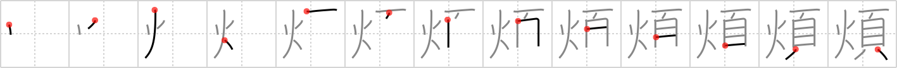

## `anxiety`

## [13]

## Reading:

### On-Yomi: ハン、ボン &mdash; Kun-Yomi: わずら.う、わずら.わす

## Heisig V6:

The existential condition of <b>anxiety</b> that arises from the inevitable frustration of our worldly passions is contained in this character. The <i>head</i> is set <i>afire</i>, causing deep torment of spirit (and a whopper of a headache).

## Koohii stories:

1) [<a href="http://kanji.koohii.com/profile/Christine_Tham">Christine_Tham</a>] 30-7-2007(173): An<strong> anxiety</strong> feels like FIRE in the HEAD.

2) [<a href="http://kanji.koohii.com/profile/sethimayne">sethimayne</a>] 9-10-2007(96): Imagine the<strong> anxiety</strong> a librarian would feel if the library caught <em>fire</em> and all the <em>pages</em> of his books were burning up.

3) [<a href="http://kanji.koohii.com/profile/scottamus">scottamus</a>] 21-12-2005(70): Many performers get &quot;Michael Jackson<strong> anxiety</strong>&quot; wherein they fear their head will catch on fire.

4) [<a href="http://kanji.koohii.com/profile/PrettyKitty">PrettyKitty</a>] 4-7-2007(22): In ancient times, they said<strong> anxiety</strong> was cause by &quot;fire in the head.&quot; Picture doctors prescibing many different crazy/silly ways to get the fire out of the patient&#039;s head. Now picture it like your watching a documentary on the History Channel about it. Not going to forget it anytime soon now. :).

5) [<a href="http://kanji.koohii.com/profile/SammyB">SammyB</a>] 5-11-2008(12): I would be feeling<strong> anxiety</strong> too if there was a <em>fire</em> on my <em>head</em>!

6) [<a href="http://kanji.koohii.com/profile/DrWarrior12">DrWarrior12</a>] 23-1-2009(8): I can&#039;t help but think of this picture when I see this kanji: tinyurl.com/4ghx93.

7) [<a href="http://kanji.koohii.com/profile/Ninjasha">Ninjasha</a>] 12-12-2007(7): <strong>ANXIETY</strong> is like a slow-burning <em>fire</em> inside your <em>head</em>.

8) [<a href="http://kanji.koohii.com/profile/romanrozhok">romanrozhok</a>] 9-5-2008(6): 煩い （うるさい）&quot;Who the hell is being so うるさい？&quot; &quot;My room mate accidentally set his thesis PAPER on FIRE with a desk candle&quot;.

9) [<a href="http://kanji.koohii.com/profile/PepeSeco">PepeSeco</a>] 10-3-2009(5): Neurons on <em>fire</em> (firing) within the <em>head</em> in a case of extreme<strong> anxiety</strong>. Fiery<strong> anxiety</strong>. Fire coming out of your head.

10) [<a href="http://kanji.koohii.com/profile/ambassadog">ambassadog</a>] 7-5-2009(4): After <em>Tuesday</em>, my <em>head</em> will be free from<strong> anxiety</strong>, as I&#039;m halfway through the week.
