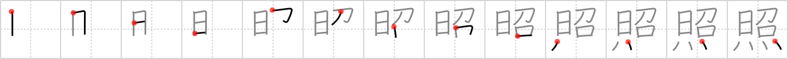

## `illuminate`

## [13]

## Reading:

### On-Yomi: ショウ &mdash; Kun-Yomi: て.る、て.らす、て.れる

## Koohii stories:

1) [<a href="http://kanji.koohii.com/profile/Christine_Tham">Christine_Tham</a>] 27-7-2007(276): SHINING FLAMES<strong> illuminate</strong>! 

2) [<a href="http://kanji.koohii.com/profile/atomiton">atomiton</a>] 16-9-2007(91): The sun was seduced to give us fire, by which we<strong> illuminate</strong> the night. 

3) [<a href="http://kanji.koohii.com/profile/rotifera">rotifera</a>] 16-11-2007(43): Just <em>shining</em> is not enough to<strong> illuminate</strong>. The shiny thing needs to be even brighter. Maybe set it on <em>fire</em>? 

4) [<a href="http://kanji.koohii.com/profile/wzafran">wzafran</a>] 2-6-2007(27): You find yourself trapped in an unfamiliar cavern, engulfed in darkness. You wield a Rod of Light with your right hand; its tip is <em>shining</em>, but faintly. Thence, with your other hand, you cast a spell and set <em>fire</em> to the rod. And this rod, which shines with much greater fervour than before, is what would <strong>illuminate</strong> a path before you, that you then follow until you reach the outer caverns. 

5) [<a href="http://kanji.koohii.com/profile/Shibo">Shibo</a>] 28-3-2008(23): The man who shines shoes in the day stands alone at night in the cold, dark city. He keeps himself warm in front of a burning trash barrel, his face <strong>illuminated</strong> by the flames. 

6) [<a href="http://kanji.koohii.com/profile/DrJones">DrJones</a>] 26-12-2007(22): The <em>seductive</em> <em>sun</em> goddess, Amaterasu   <a href="http://jisho.org/kanji/details/「天照：">「天照：</a>  　あまてらす」, who wears a mantle of <em>fire</em>, is who <strong>illuminates</strong> heaven, according to chinese mythos. I hope she can<strong> illuminate</strong> us, too! 

7) [<a href="http://kanji.koohii.com/profile/snozle">snozle</a>] 22-10-2006(7): When you <em>shine</em> <em>fire</em> (a flashlight) on something, you<strong> illuminate</strong> it. 

8) [<a href="http://kanji.koohii.com/profile/DavidZ">DavidZ</a>] 7-1-2011(6): The <strong>Illuminati</strong> emblem is an eye at the tip of a pyramid, which is <em>shining</em> upward because it&#039;s on <em>fire</em>. (Picture The Shining&#039;s Jack Nicholson&#039;s sunny, seducing face with flames below)...   <a href="http://jisho.org/kanji/details/照らす">照らす</a>  [てらす]<strong> illuminate</strong>、参照[さんしょう]  <a href="http://jisho.org/kanji/details/、照れる">、照れる</a>  [てれる] to be shy, to feel awkward. 

9) [<a href="http://kanji.koohii.com/profile/tharvey">tharvey</a>] 12-11-2009(5): The <em>shining</em> <em>flames</em><strong> illuminate</strong>s the night. 

10) [<a href="http://kanji.koohii.com/profile/gavmck">gavmck</a>] 15-9-2009(5): A night scene: The hunters faces were <em>shining</em>,<strong> illuminate</strong>d by the flickering camp <em>fire</em>. 
