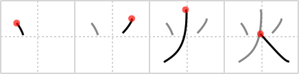

## `fire`

## [4]

## Reading:

### On-Yomi: カ &mdash; Kun-Yomi: ひ、-び、ほ-

## Heisig story:

Just as sitting before a <b>fire</b> enlivens the imagination and lets you see almost anything you want to in the flames, this kanji is so simple it lets you see almost any sort of <b>fire</b> you want to see. It no longer makes a good pictograph, but I invite you to take a pencil and paper and play with the form - first writing it as shown below and then adding lines here and there - to see what you can come up with. Everything from matchbooks to cigarette lighters to volcanic eruptions to the destruction of Sodom and Gomorrah have been found here. No doubt you, too, will find something interesting to bend your memory around these four simple strokes.

## Premitive:

To avoid confusion later on, it is best to keep to the meaning of a FIREPLACE (or HEALTH) or a raging CONFLAGRATION like a forest fire for this kanji’s primitive meaning. Another primitive element for FIRE, based on this one, is written XXX and will mean FLAMES, CAULDRON, COOKING FIRE, or an OVEN FIRE. SIMPLE For some reason, this kanji reminds me of a person running, her arms (the two drops) raised up, because she caught on fire!

## Koohii stories:

1) [<a href="http://kanji.koohii.com/profile/munia">munia</a>] 22-2-2008(57): For some reason, this kanji reminds me of a person running, her arms (the two drops) raised up, because she caught on<strong> fire</strong>!

2) [<a href="http://kanji.koohii.com/profile/raseru">raseru</a>] 16-6-2008(29): A tepee getting shot at by<strong> fire</strong> arrows.

3) [<a href="http://kanji.koohii.com/profile/mistamark">mistamark</a>] 3-9-2008(23): To be honest, it just looks like the flames of a<strong> fire</strong> to me.

4) [<a href="http://kanji.koohii.com/profile/LoneDeranger">LoneDeranger</a>] 7-2-2009(11): Looks like a flame of a campfire with two <em>drops of</em> sparks flying off.

5) [<a href="http://kanji.koohii.com/profile/ryowarrior18">ryowarrior18</a>] 16-8-2009(8): A<strong> FIRE</strong>bender from Avatar, wielding flames in both hands.

6) [<a href="http://kanji.koohii.com/profile/mparrett1">mparrett1</a>] 18-6-2006(6): A<strong> fire</strong> reminds me of the teepee shaped campfire logs, with flames jumping about on both sides.

7) [<a href="http://kanji.koohii.com/profile/Transtic">Transtic</a>] 29-12-2007(5): What about using the Human Torch as the primitive?

8) [<a href="http://kanji.koohii.com/profile/ziggr">ziggr</a>] 9-9-2006(4): (When appearing on the left as in 煩 <a href="../v4/163">anxiety</a> (#163 煩) and 畑 <a href="../v4/166">farm</a> (#166 畑), I use the primitive <em>burning fuse,</em> as in the fuse from the intro to the old Mission: Impossible TV show, which burned from left to right. This helps me keep the<strong> fire</strong> on the left side of the kanji, as the fuse burns towards the field or the head or whatever is on the right of the kanji.).

9) [<a href="http://kanji.koohii.com/profile/jbudding">jbudding</a>] 16-10-2012(2): The human torch is my favorite <em>person</em> from the Fantastic Four with<strong> FIRE</strong> burning all around him.

10) [<a href="http://kanji.koohii.com/profile/geotrismegistos">geotrismegistos</a>] 10-9-2011(2): A volcano spilling out 2 drops of lava.

### {V4: 161, V6: 173}
