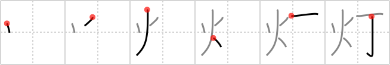

## `lamp`

## [6]

## Reading:

### On-Yomi: トウ &mdash; Kun-Yomi: ひ、ほ-、ともしび、とも.す、あかり

## Heisig story:

Since it is very hard to read by the <i>fireplace</i> without going blind from the flickering of the flames or burning up from the heat, our ancestors invented a way to <i>nail</i> down a bit of that <i>fire</i>, just enough to light up the text of their evening newspapers and no more. Voilà! The <b>lamp</b>.

## Koohii stories:

1) [<a href="http://kanji.koohii.com/profile/ceeeps">ceeeps</a>] 3-9-2007(202): Imagine old gas<strong> lamp</strong>s which had a <em>flame</em> to light up the <em>street signs</em>.

2) [<a href="http://kanji.koohii.com/profile/dwhitman">dwhitman</a>] 5-10-2007(85): A<strong> lamp</strong> is <em>fire</em> you can hang from a <em>nail</em>.

3) [<a href="http://kanji.koohii.com/profile/mdspencer">mdspencer</a>] 21-4-2008(21): When this symbol was created, a<strong> lamp</strong> was simply a <em>fire</em> at the side of the <em>street</em>.

4) [<a href="http://kanji.koohii.com/profile/Evangelo">Evangelo</a>] 20-8-2008(19): <em>Warning: This story is graphic.</em> In Rome, after the Third Servile War, the losing rebels were crucified (on T shaped crosses) and set <em>on fire</em> along the <em>road</em> back to Rome. These human<strong> lamp</strong>s lit up the massive <em>road</em> with burning corpses as a reminder not to lose against the Romans. Thanks Latin 3!

5) [<a href="http://kanji.koohii.com/profile/ACGalaga">ACGalaga</a>] 5-2-2010(9): A long time ago they used <em>fire</em> for <em>street</em><strong> lamp</strong>s.

6) [<a href="http://kanji.koohii.com/profile/wzafran">wzafran</a>] 2-6-2007(6): A <strong>lamp</strong> contains <em>fire</em> that has been <em>nailed</em> down.

7) [<a href="http://kanji.koohii.com/profile/kaminix">kaminix</a>] 2-3-2008(5): This kanji depicts a lit up <em>street pole</em>, a <em>street</em> <strong>lamp</strong>.

8) [<a href="http://kanji.koohii.com/profile/elktapestry">elktapestry</a>] 26-3-2007(5): While I also think of this one as fire that lines the street... and have even considered Hesig&#039;s story as well... still... It also helps me imagining this in a pictographic manner... the fire being a man walking up to a<strong> lamp</strong> on a pole (the line represents the bottom of the &quot;lamp shade&quot; who&#039;s full image is out of view). His arm is reaching up to turn the<strong> lamp</strong> on. See what I mean?

9) [<a href="http://kanji.koohii.com/profile/tomcase7">tomcase7</a>] 24-6-2012(3): Old street<strong> lamp</strong>s were lit with fire.

10) [<a href="http://kanji.koohii.com/profile/kakashi">kakashi</a>] 26-10-2012(2): <em>nail</em> a <em>flame</em> to the wall to serve as a<strong> lamp</strong>.
