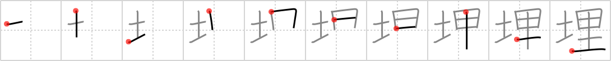

## `bury`

## [10]

## Reading:

### On-Yomi: マイ &mdash; Kun-Yomi: う.める、う.まる、う.もれる、うず.める、うず.まる、い.ける

## Heisig V6:

When we speak of <b>burying</b> something (or someone, for that matter), we usually mean putting them under <i>ground</i>. Only here, we are <b>burying</b> our beloved <i>computer</i> that has served us so well these past years. Behind us a choir chants the &quot;Dies irae, dies illa&quot; and there is much wailing and grief among the bystanders as they pass by to shovel a little <i>dirt</i> into what will be its final resting place. R.I.P.

## Koohii stories:

1) [<a href="http://kanji.koohii.com/profile/Rowan">Rowan</a>] 21-9-2007(120): You can&#039;t<strong> bury</strong> computers underground, because of the dangerous heavy metals, so you hide them behind an equally large mound of soil and hope no-one notices.

2) [<a href="http://kanji.koohii.com/profile/Dualta">Dualta</a>] 5-3-2008(80): I used SOIL to<strong> BURY</strong> my COMPUTER.

3) [<a href="http://kanji.koohii.com/profile/uberclimber">uberclimber</a>] 3-1-2011(60): <strong>Bury</strong> me in the <em>soil</em> beside my <em>parents&#039; house</em>. That&#039;s where I want to be laid to rest. 埋め込む (うめこむ) : to<strong> bury</strong>; 埋蔵 (まいぞう) : buried property, treasure trove.

4) [<a href="http://kanji.koohii.com/profile/DrJones">DrJones</a>] 19-12-2007(31): If you assigned the meaning &quot;House of the Fathers&quot; to <a href="../173">ri</a> (#173 里), this one becomes a lot easier. When I die, I want to be <strong>buried</strong> in these <em>grounds</em> so that my body can find rest at the <em>House of my fathers</em>.

5) [<a href="http://kanji.koohii.com/profile/dhalprin">dhalprin</a>] 24-5-2010(18): When I die,<strong> bury</strong> me in the soil - next to my computer.

6) [<a href="http://kanji.koohii.com/profile/johanvg">johanvg</a>] 21-7-2006(17): To<strong> bury</strong> something means to put a whole ri of soil on something.

7) [<a href="http://kanji.koohii.com/profile/uchifly">uchifly</a>] 30-9-2009(11): In China, they<strong> BURY</strong> someone under the GROUND, one RI outside the village.

8) [<a href="http://kanji.koohii.com/profile/FoxintheStars">FoxintheStars</a>] 24-8-2010(6): (Note that for<strong> bury</strong>ing a person, <a href="../816">interment</a> (#816 葬) will come later.)<strong> Bury</strong> the evidence literally by throwing <em>soil</em> onto a <em>computer</em> containing incriminating data.

9) [<a href="http://kanji.koohii.com/profile/FuDaWei">FuDaWei</a>] 19-5-2010(5): When they<strong> BURY</strong> me, reserve a plot of <em>soil</em> for my <em>computer</em>, in case God has e-mail.

10) [<a href="http://kanji.koohii.com/profile/chully">chully</a>] 26-10-2008(5): <strong>Bury</strong> me, and with the soil left over,<strong> bury</strong> my computer right next to me.
