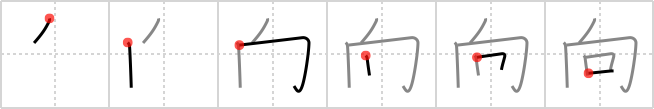

# {向}

## `yonder`

## Strokes: 6

## Reading:

### On-Yomi: コウ &mdash; Kun-Yomi: む.く、む.い、-む.き、む.ける、-む.け、む.かう、む.かい、む.こう、む.こう-、むこ、むか.い

### Examples: 向かう (む.かう), 向く (む.く), 向ける (む.ける), 向こう (む.こう)

## Words:

意向(いこう): intention, idea, inclination

向上(こうじょう): elevation, rise, improvement, advancement, progress

志向(しこう): intention, aim

動向(どうこう): trend, tendency, movement, attitude

一向(ひたすら): earnestly

日向(ひなた): sunny place, in the sun

向かう(むかう): to face, to go towards

向き(むき): direction, situation, exposure, aspect, suitability

向け(むけ): for ~, oriented towards ~

傾向(けいこう): tendency, trend, inclination

方向(ほうこう): direction, course, way

向かい(むかい): facing, opposite, across the street, other side

向う(むかう): to face, go towards

向く(むく): to face

向ける(むける): turn towards, point

向こう(むこう): beyond, over there, opposite direction, the other party
