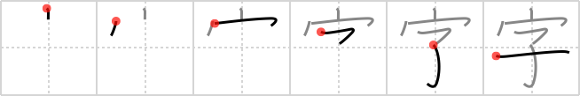

## `character`

## [6]

## Reading:

### On-Yomi: ジ &mdash; Kun-Yomi: あざ、あざな、-な

## Heisig story:

Here is the character for <b>character</b> itself. Not just kanji, but any written <b>character</b> from hieroglyphs to Sanskrit to our own Roman alphabet. It shows us simply a <i>child</i> in a <i>house</i>. But let us take advantage of the double-meaning of the key word to note that just as a <i>child</i> born to a Japanese <i>house</i> is given <b>characters</b> for its name, so it is also stamped with the <b>character</b> of those who raise it from infancy on.

## Koohii stories:

1) [<a href="http://kanji.koohii.com/profile/Christine_Tham">Christine_Tham</a>] 30-7-2007(110): CHILDren learn Kanji<strong> character</strong>s underneath a HOUSE.

2) [<a href="http://kanji.koohii.com/profile/komodo">komodo</a>] 22-6-2008(82): &quot;Why do I have to wear this roof on my head all the time father?&quot; &quot;Shut up! It builds<strong> character</strong>!&quot;.

3) [<a href="http://kanji.koohii.com/profile/axelb">axelb</a>] 19-3-2008(53): The first kanji<strong> character</strong>s you will learn in Japan is probably learnt at home (in the <em>house</em> of your family) when you are still a <em>child</em>. Imagine a really small preschool child doing this (to prevent confusing house with school like in <a href="../324">study</a> (#324 学)).

4) [<a href="http://kanji.koohii.com/profile/harusame">harusame</a>] 30-4-2009(22): The way a child grows up in his house determines his<strong> character</strong>.

5) [<a href="http://kanji.koohii.com/profile/applesuki">applesuki</a>] 15-2-2006(19): Imagine a child in his home (under the roof) sitting at the kitchen table practicing his kanji<strong> character</strong>s.

6) [<a href="http://kanji.koohii.com/profile/andrew2k54">andrew2k54</a>] 11-2-2010(9): That child never leaves his house because he studies Kanji<strong> character</strong>s all day.

7) [<a href="http://kanji.koohii.com/profile/Keiran_Halcyon">Keiran_Halcyon</a>] 13-7-2009(4): Ahh...The great debate of whether we are born with our<strong> character</strong> as a <em>child</em>, or we learn our<strong> character</strong> under the <em>roof we are raised in</em>.

8) [<a href="http://kanji.koohii.com/profile/vichango">vichango</a>] 12-1-2009(4): Surely the first <strong>characters</strong> you learnt as a child, you learnt them at <em>home</em>, some time before going to school.

9) [<a href="http://kanji.koohii.com/profile/stan_in_japan">stan_in_japan</a>] 26-4-2013(3): While this CHILD is under my ROOF, it will practice Japanse<strong> character</strong> writing! (primitive: roof. chimney stack on a roof with eaves).

10) [<a href="http://kanji.koohii.com/profile/Maxim_Tomato">Maxim_Tomato</a>] 8-11-2008(2): A <em>child</em> will never develop<strong> character</strong> if it stays in the <em>house</em> all day!
