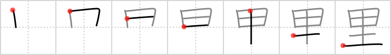

## `ri`

## [7]

## Reading:

### On-Yomi: リ &mdash; Kun-Yomi: さと

## Heisig story:

That's right - a <b><i>ri</i></b>. Don't bother looking it up in your English dictionary; it's a Japanese word for measuring distances. One <b><i>ri</i></b> is about 4 kilometers or 2.5 miles. The kanji depicts how the measure came to be used. Atop we see the <i>rice field</i>, and below the element for <i>land</i>. Those four sections you see in the <i>rice field</i> (and which we made mention of when first we introduced the character in frame 14) are actually measurements of <i>land</i>, much the same as farm-sections in the United States have given us the notion of a &quot;country mile.&quot; The <i>land</i> division based on the size of a <i>rice field</i> is called a <b><i>ri</i></b>.

## Premitive:

To get a more concrete primitive meaning for this kanji, we shall refer to it as a COMPUTER, a meaning deriving from the kanji for logic, which we will meet in Lesson 12. SIMPLE The ri is a Japanese way of measuring the area of the GROUND underneath a RICE FIELD.

## Koohii stories:

1) [<a href="http://kanji.koohii.com/profile/Christine_Tham">Christine_Tham</a>] 30-7-2007(141): The<strong> ri</strong> is a Japanese way of measuring the area of the GROUND underneath a<strong> RI</strong>CE FIELD.

2) [<a href="http://kanji.koohii.com/profile/DrJones">DrJones</a>] 18-12-2007(86): Hint: Heisig makes here a severe disservice to everyone by using a weird keyword for this character. You&#039;ll save a lot (and I mean, a whole lot) of trouble later by giving it instead its intended meaning: <strong>House of the Parents</strong>.

3) [<a href="http://kanji.koohii.com/profile/Bullfrog">Bullfrog</a>] 15-4-2008(49): It&#039;s not just any computer. It&#039;s an old Ata<strong>ri</strong>.

4) [<a href="http://kanji.koohii.com/profile/uberclimber">uberclimber</a>] 27-2-2011(35): My <strong>parents&#039; house</strong> is on a <em>rice field</em>; I <em>compute</em> the <em>ground</em> area being one <strong>ri</strong> by one <strong>ri</strong>. 古里 (ふるさと) : home town, birthplace, old village, historic village, native place, one&#039;s old home; 郷里 (きょうり) : birth-place, home town.

5) [<a href="http://kanji.koohii.com/profile/elktapestry">elktapestry</a>] 1-2-2009(33): It frustrates me that Hesig doesn&#039;t give any mention to another prominent meaning of the 里 /<strong> Ri</strong> Kanji being used for さと meaning a country village or home. perhaps he thought it would be too confusing for one to remember two different types of villages and distinguish this from 町 ... however... If I think of that one as まち and this one as さと it keeps things straight in my head and allows me to skip the whole confusing path of thinking of this as a &quot;computer&quot; which just seems somewhat wrong.

6) [<a href="http://kanji.koohii.com/profile/emanalo">emanalo</a>] 2-8-2008(20): I&#039;m sure Heisig uses <em>logic</em> as a keyword because it forms part of the compound for <a href="../v4/265">logic</a> (#265 理) which is VERY frequently used in Japanese newspapers, much moreso than its meanings as an old Japanese unit of measurement (<em>ri</em>) or parents home. You&#039;ll find kanji has this quality a lot, having different meanings, so better roll with it than criticize the author of this very valuable kanji learning method. I LOVE this book!

7) [<a href="http://kanji.koohii.com/profile/mezbup">mezbup</a>] 6-11-2008(14): The computer at my parent&#039;s house runs on Windows<strong> Ri</strong>. It was programmed by the dirt brains at microsoft 4km&#039;s from my house.

8) [<a href="http://kanji.koohii.com/profile/opie226">opie226</a>] 10-4-2008(10): The<strong> ri</strong> is the unit of measurement for the ground distance of a<strong> ri</strong>ce field (about 4 kilometers). A strong horse was called a 千里馬 せんりば. Meaning it could cover the distance of 1000<strong> ri</strong> (4000km) in one day.

9) [<a href="http://kanji.koohii.com/profile/TaylorSan">TaylorSan</a>] 17-1-2009(9): I had to<strong> Ri</strong> boot my crappy Computer.

10) [<a href="http://kanji.koohii.com/profile/Ningen">Ningen</a>] 27-8-2008(9): The<strong> RI</strong> is a Japanese measurement used to divide the <em>land</em> below into <em>RIce fields</em> above. It&#039;s perfectly <em>logical</em> so you don&#039;t even need a <em>computer</em>.

### {V4: 173, V6: 185}
