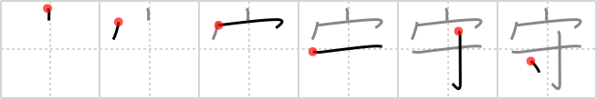

## `guard`

## [6]

## Reading:

### On-Yomi: シュ、ス &mdash; Kun-Yomi: まも.る、まも.り、もり、-もり、かみ

## Heisig story:

The notion of <b>guarding</b> something easily brings to mind the image of someone standing <b>guard</b>, like the royal soldiers in front of Buckingham Palace or the Pope's Swiss <b>Guard</b>. The whole idea of hiring <b>guards</b> is that they should stick like <i>glue</i> to your <i>house</i> to protect it from unwanted prowlers. So go ahead and <i>glue</i> a <b>guard</b> to your <i>house</i> in imagination.

## Koohii stories:

1) [<a href="http://kanji.koohii.com/profile/certain">certain</a>] 5-4-2006(173): A<strong> GUARD</strong> is usually &quot;glued&quot; to the house he watches.

2) [<a href="http://kanji.koohii.com/profile/rakutenka">rakutenka</a>] 2-7-2007(65): A<strong> guard</strong> provides a <em>measure</em> of security to those under a <em>roof</em>.

3) [<a href="http://kanji.koohii.com/profile/Ninjasha">Ninjasha</a>] 16-12-2007(37): A good<strong> GUARD</strong> should stick to your <em>house</em> like <em>glue</em> and be willing to take any <em>measures</em> to protect you.

4) [<a href="http://kanji.koohii.com/profile/strobrod">strobrod</a>] 5-4-2009(12): A good<strong> guard</strong> never leaves the <em>house</em> he watches over. He&#039;s practically <em>glued</em> to it.

5) [<a href="http://kanji.koohii.com/profile/jshield1">jshield1</a>] 21-4-2009(6): A<strong> guard</strong> gives those under a roof a measure of security.

6) [<a href="http://kanji.koohii.com/profile/jabberwockychortles">jabberwockychortles</a>] 25-5-2010(3): A<strong> guard</strong> must <em>stick</em> close to the <em>house</em>.

7) [<a href="http://kanji.koohii.com/profile/alphador">alphador</a>] 29-1-2010(3): Le<strong> GUARD</strong>IE svizzere devono rimanere perfettamente immobili a difesa di un EDIFICIO, come se vi fossero INCOLLATE.

8) [<a href="http://kanji.koohii.com/profile/Socrates81">Socrates81</a>] 24-12-2009(3): The Queen&#039;s<strong> Guard</strong> at Buckingham Palace stay in their little <em>houses</em> and are <em>glued</em> to the spot.

9) [<a href="http://kanji.koohii.com/profile/atomiton">atomiton</a>] 11-4-2009(2): I like to stick gargoyles all over the house. Or glue plastic toy soldiers all over the house to keep<strong> guard</strong>. If you&#039;ve watched Toy Story, you&#039;d see those little plastic army men glued to the gutter, just under the roof of the house.

10) [<a href="http://kanji.koohii.com/profile/coverup">coverup</a>] 28-5-2008(2): I<strong> guard</strong> my <em>house</em> by sealing it up with <em>glue</em>.
