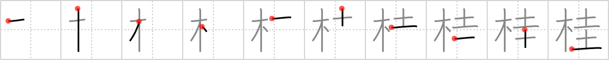

## `Japanese Judas-tree`

## [10]

## Reading:

### On-Yomi: ケイ &mdash; Kun-Yomi: かつら

## Koohii stories:

1) [<a href="http://kanji.koohii.com/profile/fuaburisu">fuaburisu</a>] 26-1-2006(158): Simple mnemonic : &quot;The<strong> Japanese Judas-tree</strong> is the <em>tree</em> on which Judas hang himself to the <em>ivy</em>&quot; (Judas the traitor of the Christian bible). Just picture Judas hanging himself, using <em>ivy</em> as a if it was a rope. 

2) [<a href="http://kanji.koohii.com/profile/Ninjasha">Ninjasha</a>] 6-1-2008(92): A <em>tree</em> covered in poison <em>ivy</em> will quickly betray you, thus the name<strong> JAPANESE JUDAS-TREE</strong>. 

3) [<a href="http://kanji.koohii.com/profile/kaminix">kaminix</a>] 2-3-2008(35): The <strong>Katsura</strong> (<strong>Japanese Judas-tree</strong>) is a thin <em>tree</em> (sort of like the stretched out   <a href="http://jisho.org/kanji/details/木">木</a>   used in this kanji) with little green (the color of an emerald, a <em>jewel</em>) leaves. <a href="http://en.wikipedia.org/wiki/Katsura_">http://en.wikipedia.org/wiki/Katsura_</a>(tree). 

4) [<a href="http://kanji.koohii.com/profile/romanrozhok">romanrozhok</a>] 4-8-2008(15): Japanese JEWEL TREE sounds like JUDAS-tree. 

5) [<a href="http://kanji.koohii.com/profile/elktapestry">elktapestry</a>] 28-3-2007(13): Interesting... this tree is called a かつら (Katura) Tree in Japan. It got the<strong> Japanese Judas-Tree</strong> distinction because it bears a similar leaf-type to the Judas Tree found in Europe and such. For fun word-play with both the Judas &amp; Katsura distinctions... it might be good to learn that a homonym for Katsura (w/different Kanji 鬘) is a hairpiece or wig! So now imagine some dishevled business man with a funny hairpiece stringing ivy around the Katsura/Judas tree to hang himself with!! 

6) [<a href="http://kanji.koohii.com/profile/Chrysostym">Chrysostym</a>] 20-3-2009(7): The Japanese Judas TREE grows SQUARE JEWEL leaves. 

7) [<a href="http://kanji.koohii.com/profile/alphador">alphador</a>] 19-4-2010(5): Un&#039;ALBERO con una corda d&#039;EDERA per impiccarsi che pende dai rami, è L&#039;ALBERO GIAPPONESE DI GIUDA. 

8) [<a href="http://kanji.koohii.com/profile/oohansel">oohansel</a>] 21-4-2009(5): The<strong> Japanese Judas-tree</strong> is a TREE with a SQUARED JEWEL. 

9) [<a href="http://kanji.koohii.com/profile/ashman63">ashman63</a>] 25-3-2008(4): A<strong> Japanese Judas-tree</strong> is a <em>tree</em> with <em>ivy</em> hanging off it. 

10) [<a href="http://kanji.koohii.com/profile/wildstar">wildstar</a>] 5-7-2012(3): The<strong> Japanese Judas-TREE</strong> is crawling with IVY. 
