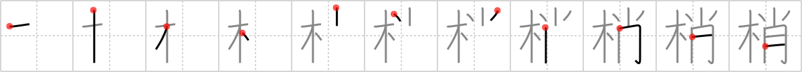

## `treetops`

## [11]

## Reading:

### On-Yomi: ショウ &mdash; Kun-Yomi: こずえ、くすのき

## Heisig story:

As the days grow shorter and shorter, or so the northern European myth goes, the fear grows that the sun will take its leave of us altogether, abandoning the world to total darkness. Fixing <i>candles</i> to the branches of evergreen <i>trees</i>, it was believed, would lure the sun back (like things attracting like things), whence the custom of the lighted tree that eventually found its way into our Christmas customs. The story is a lot longer and more complex than that, but it should help to fix the image of climbing high up into the <b>treetops</b> to fix <i>candles</i> on the <i>tree</i>.

## Koohii stories:

1) [<a href="http://kanji.koohii.com/profile/sethimayne">sethimayne</a>] 30-9-2007(184): At Christmas time, on the<strong> treetops</strong>, people used to place great big <em>candles</em> (Now we usually place a star instead).

2) [<a href="http://kanji.koohii.com/profile/Tatiana">Tatiana</a>] 22-10-2006(46): If you cut off the<strong> treetops</strong>, they still <em>resemble</em> the <em>trees</em> they used to be part of.<strong> Treetops</strong>=<em>tree</em> <em>resemblance</em>.

3) [<a href="http://kanji.koohii.com/profile/astgtciv">astgtciv</a>] 14-4-2007(25): A gigantic <em>candle</em> is standing to the right of the <em>tree</em>, the flame rising higher than the<strong> treetops</strong>.

4) [<a href="http://kanji.koohii.com/profile/Ji_suss">Ji_suss</a>] 24-8-2008(17): Doesn&#039;t really mean<strong> treetops</strong>. It means the end of a branch. In English, the name for each year&#039;s new growth at the end of every branch is a &quot;candle&quot;. Same in Japanese.

5) [<a href="http://kanji.koohii.com/profile/LeoOra">LeoOra</a>] 28-2-2008(12): The tops of the trees, as in the fractal theory, resembles a whole tree if you look from afar.

6) [<a href="http://kanji.koohii.com/profile/bspitz">bspitz</a>] 22-10-2009(8): The treetop is the spot on the Christmas <em>tree</em> where the <em>candle</em> is placed.

7) [<a href="http://kanji.koohii.com/profile/rmontagner">rmontagner</a>] 23-1-2010(6): The<strong> treetops</strong> look like candles.

8) [<a href="http://kanji.koohii.com/profile/tuuli">tuuli</a>] 7-7-2008(4): <strong>Treetops</strong> at xmas are usually decorated with stars, but this NASA astronaut is obsessed, and puts up a <em>little moon</em> instead.

9) [<a href="http://kanji.koohii.com/profile/stan_in_japan">stan_in_japan</a>] 20-5-2013(3): Ewoks (StarWars) who live in the<strong> treetops</strong> don&#039;t have electricity so they use candles, or something resembling them.

10) [<a href="http://kanji.koohii.com/profile/zenhill">zenhill</a>] 18-7-2010(3): <strong>Treetops</strong> are hit by the sun all day lighting them up like candles. 梢 [こずえ].
