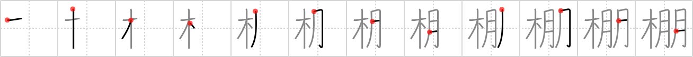

## {202}

## `shelf`

## [12]

## Reading:

### On-Yomi: ホウ &mdash; Kun-Yomi: たな、-だな

### Examples: 棚 (たな)

## Words:

戸棚(とだな): cupboard, locker, closet, wardrobe

棚(たな): shelf

本棚(ほんだな): bookshelves
