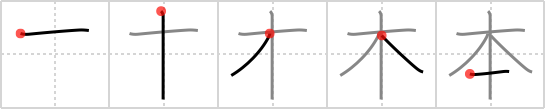

## `book`

## [5]

## Reading:

### On-Yomi: ホン &mdash; Kun-Yomi: もと

### Examples: 本 (もと)

## Words:

脚本(きゃくほん): scenario

根本(こんぽん): origin, source, foundation, root, base, principle

台本(だいほん): libretto, scenario

手本(てほん): model, pattern

本格(ほんかく): propriety, fundamental rules

本館(ほんかん): main building

本気(ほんき): seriousness, truth, sanctity

本質(ほんしつ): essence, true nature, reality

本体(ほんたい): substance, real form, object of worship

本当(ほんとう): truth, reality

本音(ほんね): real intention, motive

本の(ほんの): mere, only, just

本能(ほんのう): instinct

本場(ほんば): home, habitat, center, best place, genuine

本文(ほんぶん): text (of document), body (of letter)

本名(ほんみょう): real name

基本(きほん): foundation, basis, standard

資本(しほん): funds, capital

標本(ひょうほん): example, specimen

本人(ほんにん): the person himself

本部(ほんぶ): headquarters

本物(ほんもの): genuine article

本来(ほんらい): essentially, naturally, by nature, in (and of) itself, originally

見本(みほん): sample

本(ほん): book

本棚(ほんだな): bookshelves

## Koohii stories:

1) [<a href="http://kanji.koohii.com/profile/Christine_Tham">Christine_Tham</a>] 31-7-2007(73): The origin of a<strong> book</strong> is paper made out of TREEs. ONE tree can make many<strong> book</strong>s. 

2) [<a href="http://kanji.koohii.com/profile/ggwar">ggwar</a>] 7-8-2009(25): A<strong> book</strong> is <em>one</em> slice of a <em>tree</em>. 

3) [<a href="http://kanji.koohii.com/profile/burento5">burento5</a>] 14-3-2008(24): An axe cutting a tree to make<strong> book</strong>s. 

4) [<a href="http://kanji.koohii.com/profile/johanvg">johanvg</a>] 10-7-2006(11): <strong>Book</strong>s are the root of all knowledge (in Chinese this character means root or basis). 

5) [<a href="http://kanji.koohii.com/profile/Raitasar">Raitasar</a>] 6-5-2009(5): Sad &#039;Fact&#039;: You have to <em>cut</em> down <em>ten</em> oriental <em>tree</em>s just to produce one<strong> book</strong>! 

6) [<a href="http://kanji.koohii.com/profile/pilot_sun16">pilot_sun16</a>] 28-1-2010(4): The origin of a<strong> book</strong> is paper made out of TREEs. ONE tree can make many<strong> book</strong>s. ｛もと、ホン｝   <a href="http://jisho.org/kanji/details/本">本</a>  （ホン）book,　  <a href="http://jisho.org/kanji/details/日本">日本</a>  （ニホン）Japan,　  <a href="http://jisho.org/kanji/details/日本語">日本語</a>  （ニホンゴ）Japanese language,   <a href="http://jisho.org/kanji/details/山本さん">山本さん</a>  （やまもとさん）Mr/Ms. Yamamoto. 

7) [<a href="http://kanji.koohii.com/profile/Ningen">Ningen</a>] 1-9-2008(4): It&#039;s sad, but the BASIS of a<strong> BOOK</strong> is a <em>cut tree</em>. 

8) [<a href="http://kanji.koohii.com/profile/CharleneC">CharleneC</a>] 31-5-2012(2): I&#039;d love to be the <em>one</em> reading a<strong> book</strong> under a <em>tree</em>. 

9) [<a href="http://kanji.koohii.com/profile/lee101">lee101</a>] 2-8-2011(2): Just remember it. 

10) [<a href="http://kanji.koohii.com/profile/Asayoru">Asayoru</a>] 30-8-2010(2): <strong>Book</strong>s are the <strong>root</strong>s of knowledge, but their <strong>basis</strong> is a slice of a <em>tree</em>. 
