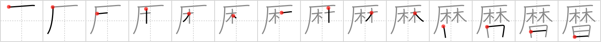

## {213}

## `calendar`

## [14]

## Reading:

### On-Yomi: レキ &mdash; Kun-Yomi: こよみ、りゃく

### Examples: 暦 (こよみ)

## Words:

還暦(かんれき): 60th birthday

暦(こよみ): calendar, almanac

西暦(せいれき): Christian Era, Anno Domini (A.D.)
