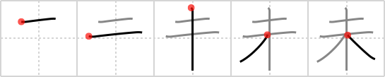

## `not yet`

## [5]

## Reading:

### On-Yomi: ミ、ビ &mdash; Kun-Yomi: いま.だ、ま.だ、ひつじ

## Words:

未だ(いまだ): as yet, hitherto, not yet (neg)

未(ひつじ): eighth sign of Chinese zodiac (The Ram 1pm-3pm south-southwest June)

未開(みかい): savage land, backward region, uncivilized

未婚(みこん): unmarried

未熟(みじゅく): inexperience, unripeness, raw, unskilled, immature, inexperienced

未知(みち): not yet known

未定(みてい): not yet fixed, undecided, pending

未練(みれん): lingering affection, attachment, regret(s), reluctance

未だ(まだ): yet, still, more, besides

未満(みまん): less than, insufficient

未来(みらい): future tense, the future (usually distant), the world to come

## Koohii stories:

1) [<a href="http://kanji.koohii.com/profile/dat5h">dat5h</a>] 15-11-2008(148): I believe a better version of that by mameha1977: [Cheat] Remember these as a set: The tree (  <a href="http://jisho.org/kanji/details/木">木</a>  ) does<strong> not yet</strong> (  <a href="http://jisho.org/kanji/details/未">未</a>  ) have exremities (  <a href="http://jisho.org/kanji/details/末">末</a>  ) of vermilion (  <a href="http://jisho.org/kanji/details/朱">朱</a>  ). 

2) [<a href="http://kanji.koohii.com/profile/mameha1977">mameha1977</a>] 16-10-2007(64): [Cheat] Remember these as a set: The tree (  <a href="http://jisho.org/kanji/details/木">木</a>  ) is<strong> not yet</strong> (  <a href="http://jisho.org/kanji/details/末">末</a>  ) vermilion (  <a href="http://jisho.org/kanji/details/朱">朱</a>  ). 

3) [<a href="http://kanji.koohii.com/profile/DeadLugosi">DeadLugosi</a>] 13-8-2008(41): This TREE is<strong> not yet</strong> fully grown: it&#039;s only ONE year old. 

4) [<a href="http://kanji.koohii.com/profile/Ameyama">Ameyama</a>] 26-2-2008(41): &quot;Have you sawed off those two smaller branches at the top of the tree?&quot; &quot;Not yet...&quot;. 

5) [<a href="http://kanji.koohii.com/profile/squeaky_lill_mk">squeaky_lill_mk</a>] 5-4-2009(20): The top branch of the tree is<strong> not yet</strong> as long as the bottom one. 

6) [<a href="http://kanji.koohii.com/profile/dwhitman">dwhitman</a>] 5-10-2007(11): The tree is <strong>not yet</strong> fully grown. 

7) [<a href="http://kanji.koohii.com/profile/Yasser">Yasser</a>] 29-10-2008(6): A &quot;ten&quot;-year-old oak &quot;tree&quot; is<strong> not yet</strong> considered mature! 

8) [<a href="http://kanji.koohii.com/profile/Wally">Wally</a>] 27-2-2009(5): Remember these as a set: The TREE (  <a href="http://jisho.org/kanji/details/木">木</a>  ) is<strong> not yet</strong> (  <a href="http://jisho.org/kanji/details/未">未</a>  ) VERMILION (  <a href="http://jisho.org/kanji/details/朱">朱</a>  ), and has not reached its EXTREMITY (  <a href="http://jisho.org/kanji/details/末">末</a>  ). 

9) [<a href="http://kanji.koohii.com/profile/Tom_Bombadil">Tom_Bombadil</a>] 5-10-2010(4): The top branches of this <em>tree</em> are<strong> not yet</strong> fully grown. 

10) [<a href="http://kanji.koohii.com/profile/LoneDeranger">LoneDeranger</a>] 4-1-2010(4): This TREE has just ONE branch at the top. It is<strong> not yet</strong> fully grown. 
