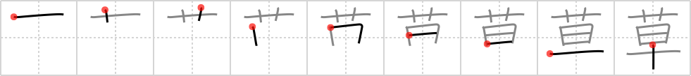

# {224}

## `grass`

## [9]

## Reading:

### On-Yomi: ソウ &mdash; Kun-Yomi: くさ、くさ-、-ぐさ

### Examples: 草 (くさ)

## Words:

草臥れる(くたびれる): to get tired, to wear out

煙草(たばこ): (pt:) (n) (uk) tobacco (pt: tabaco), cigarettes

草履(ぞうり): sandals

草(くさ): grass
