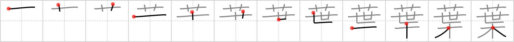

# {葉}

## `leaf`

## Strokes: 12

## Reading:

### On-Yomi: ヨウ &mdash; Kun-Yomi: は

### Examples: 葉 (は)

## Words:

落ち葉(おちば): fallen leaves, leaf litter, defoliation, shedding leaves

紅葉(こうよう): autumn colours

言葉遣い(ことばづかい): speech, expression, wording

紅葉(もみじ): autumn colours, (Japanese) maple

葉(は): leaf

言葉(ことば): word(s), phrase, language, speech

葉書(はがき): postcard
