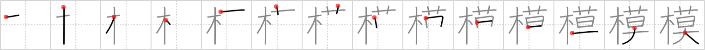

# {229}

## `imitation`

## [14]

## Reading:

### On-Yomi: モ、ボ

### Examples: 模範 (もはん), 模型 (もけい), 模倣 (もほう)

## Words:

規模(きぼ): scale, scope, plan, structure

模型(もけい): model, dummy, maquette

模索(もさく): groping (for)

模範(もはん): exemplar, exemplification, exemplum, model, example

模倣(もほう): imitation, copying

模様(もよう): pattern, figure, design
