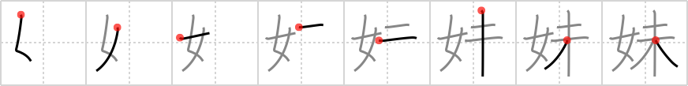

## `younger sister`

## [8]

## Reading:

### On-Yomi: マイ &mdash; Kun-Yomi: いもうと

## Heisig story:

The <b>younger sister</b> in the family is the <i>woman</i> in the family who, like the newest branch in a tree, is <i>not yet</i> old enough or mature enough to do everything the elder sister can do (See frame 442).

## Koohii stories:

1) [<a href="http://kanji.koohii.com/profile/Christine_Tham">Christine_Tham</a>] 31-7-2007(172): My<strong> younger sister</strong> is NOT YET a fully grown WOMAN.

2) [<a href="http://kanji.koohii.com/profile/Istvan">Istvan</a>] 12-6-2007(50): Is your<strong> younger sister</strong> a woman? Not yet! Damn!

3) [<a href="http://kanji.koohii.com/profile/Ninjasha">Ninjasha</a>] 17-1-2008(34): My<strong> YOUNGER SISTER</strong> is a <em>woman</em> who will always be <em>not yet</em> my age.

4) [<a href="http://kanji.koohii.com/profile/tharvey">tharvey</a>] 31-1-2009(12): My<strong> younger sister</strong> is a <em>woman</em> who is <em>not yet</em> fully grown.

5) [<a href="http://kanji.koohii.com/profile/daredawg3583">daredawg3583</a>] 7-12-2007(11): My<strong> younger sister</strong> is not a girl, but NOT YET a woman (Brittany Spears).

6) [<a href="http://kanji.koohii.com/profile/ChieShorts">ChieShorts</a>] 9-2-2012(9): I threw my <strong>imouto</strong> onto the bed and she landed with a <em>POMF =3</em>. &quot;What are we gonna do on the bed?&quot; she asked. &quot;I can&#039;t tell you, <em>not yet</em>&quot; I replied. (このシスコンどもめ。).

7) [<a href="http://kanji.koohii.com/profile/overture2112">overture2112</a>] 29-8-2010(5): Yoda advised that the<strong> younger sister</strong> was a <em>woman</em> <em>not yet</em>.

8) [<a href="http://kanji.koohii.com/profile/SammyB">SammyB</a>] 30-7-2008(4): Alas, his<strong> younger sister</strong> was <em>not yet</em> a date-able <em>woman</em>.

9) [<a href="http://kanji.koohii.com/profile/JHastings">JHastings</a>] 23-12-2012(3): <strong>Younger sister</strong>, you&#039;ll be a <em>woman</em> soon. But <em>not yet</em>.

10) [<a href="http://kanji.koohii.com/profile/Halorien">Halorien</a>] 27-1-2013(2): My<strong> younger sister</strong> isn&#039;t a <em>woman</em>-- <em>not yet</em>.
