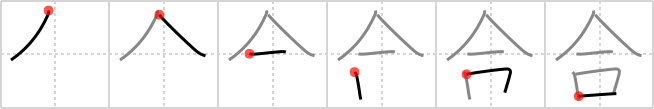

## {253}

## `fit`

## [6]

## Reading:

### On-Yomi: ゴウ、ガッ、カッ &mdash; Kun-Yomi: あ.う、-あ.う、あ.い、あい-、-あ.い、-あい、あ.わす、あ.わせる、-あ.わせる

### Examples: 合同 (ごうどう), 合計 (ごうけい), 結合 (けつごう), 合併 (がっぺい), 合宿 (がっしゅく), 合点 (がてん), 合う (あ.う), 合わす (あ.わす), 合わせる (あ.わせる)

## Words:

合間(あいま): interval

合わす(あわす): to join together, to face, to unite, to be opposite, to combine, to connect, to add up, to mix, to match, to overlap, to compare, to check with

合わせ(あわせ): joint together, opposite, facing

打ち合わせ(うちあわせ): business meeting, previous arrangement, appointment

打ち合わせる(うちあわせる): to knock together, to arrange

化合(かごう): chemical combination

合唱(がっしょう): chorus, singing in a chorus

合致(がっち): agreement, concurrence, conforming to

合併(がっぺい): combination, union, amalgamation, consolidation, merger, coalition, fusion, annexation, affiliation, incorporation

組み合わせ(くみあわせ): combination

組み合わせる(くみあわせる): to join together, to combine, to join up

結合(けつごう): combination, union

合意(ごうい): agreement, consent, mutual understanding

合議(ごうぎ): consultation, conference

合成(ごうせい): synthesis, composition, synthetic, composite, mixed, combined, compound

照合(しょうごう): collation, comparison

知り合い(しりあい): acquaintance

総合(そうごう): synthesis, coordination, putting together, integration, composite

付き合う(つきあう): to associate with, to keep company with, to get on with

出合う(であう): to meet by chance, to come across, to happen to encounter, to hold a rendezvous, to have a date

問い合わせる(といあわせる): to enquire, to seek information

統合(とうごう): integration, unification, synthesis

話し合い(はなしあい): discussion, conference

複合(ふくごう): composite, complex

待ち合わせ(まちあわせ): appointment

間に合う(まにあう): to be in time (for)

見合い(みあい): formal marriage interview

見合わせる(みあわせる): to exchange glances, to postpone, to suspend operations, to refrain from performing an action

割合(わりあい): rate, ratio, proportion, comparatively, contrary to expectations

合図(あいず): sign, signal

合わせる(あわせる): join together, connect, unite, combine, add up, mix, match, overlap, be opposite, face, compare, check with

打合せ(うちあわせ): business meeting, appointment, previous arrangement

会合(かいごう): meeting, assembly

組合(くみあい): association, union

合格(ごうかく): success, passing (e.g. exam), eligibility

合計(ごうけい): sum total, total amount

合同(ごうどう): combination, incorporation, union, amalgamation, fusion, congruence

合理(ごうり): rational

合流(ごうりゅう): confluence, union, linking up, merge

混合(こんごう): mixing, mixture

集合(しゅうごう): gathering, assembly, meeting, (mathematics) set

付き合い(つきあい): association, socializing, fellowship

付合う(つきあう): associate with, keep company with, get on with

釣り合う(つりあう): balance, be in harmony, suit

出合い(であい): an encounter

問い合わせ(といあわせ): enquiry

似合う(にあう): suit, match, become, be like

話し合う(はなしあう): discuss, talk together

待合室(まちあいしつ): waiting room

待ち合わせる(まちあわせる): rendezvous, meet at a prearranged place and time

連合(れんごう): union, alliance

合う(あう): fit, suit, be correct

具合(ぐあい): condition

試合(しあい): game

都合(つごう): circumstances, convenience

場合(ばあい): case, occasion

割合に(わりあいに): comparatively
