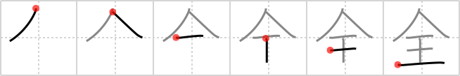

## `whole`

## [6]

## Reading:

### On-Yomi: ゼン &mdash; Kun-Yomi: まった.く、すべ.て

## Heisig V6:

<b>Wholeness</b> suggests physical and spiritual health, &quot;having your act together.&quot; The kanji-image for <b>wholeness</b> depicts being &quot;<i>king</i> under your own <i>umbrella</i>,&quot; that is, giving order to your own life. I know it sounds terribly abstract, but what could be more abstract than the word <b>whole</b>?

## Koohii stories:

1) [<a href="http://kanji.koohii.com/profile/dwhitman">dwhitman</a>] 18-10-2007(168): The fat <em>king</em> hogs the<strong> whole</strong> space under his <em>umbrella</em>. (tweaked version of radical tyro&#039;s story. &quot;fat&quot; makes a more vivid image for me.).

2) [<a href="http://kanji.koohii.com/profile/radical_tyro">radical_tyro</a>] 20-12-2005(121): The <em>king</em> takes up the<strong> whole</strong> space under his <em>umbrella</em>.

3) [<a href="http://kanji.koohii.com/profile/mhheie">mhheie</a>] 4-4-2008(69): King Arthur united the<strong> whole</strong> of England under his umbrella. (The umbrella methophore works pretty good here, due to England&#039;s miserable weather).

4) [<a href="http://kanji.koohii.com/profile/baldy514">baldy514</a>] 3-1-2009(17): You need a king sized umbrella to keep your<strong> whole</strong> body dry.

5) [<a href="http://kanji.koohii.com/profile/mspertus">mspertus</a>] 4-6-2006(10): This is similar to radical_tyro&#039;s story, but has a few points that help me. Whenever it rains, the <em>king</em> hogs the<strong> whole</strong> <em>umbrella,</em> and we can&#039;t do anything about it (because, after all, he is the <em>king</em>).

6) [<a href="http://kanji.koohii.com/profile/kirkaking">kirkaking</a>] 22-12-2011(6): The<strong> whole</strong> of the nation is subsumed under the <em>umbrella</em> of the <em>king</em>.

7) [<a href="http://kanji.koohii.com/profile/zazen666">zazen666</a>] 27-12-2007(6): I cant believe the king ate the<strong> whole</strong> umbrella!

8) [<a href="http://kanji.koohii.com/profile/P2daGn3">P2daGn3</a>] 4-6-2008(5): The<strong> whole</strong> kingdom can&#039;t fit under the royal umbrella, just the king.

9) [<a href="http://kanji.koohii.com/profile/lmcrtk">lmcrtk</a>] 13-4-2009(4): The King was under his Umbrella while the<strong> Whole</strong> town got wet. A selfish king he was.

10) [<a href="http://kanji.koohii.com/profile/MiyuYamano">MiyuYamano</a>] 6-6-2012(3): The King takes up the<strong> whole</strong> umbrella.
