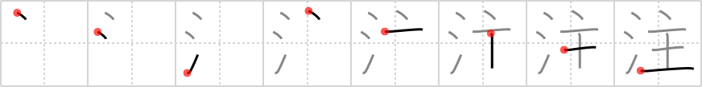

## `pour`

## [8]

## Reading:

### On-Yomi: チュウ &mdash; Kun-Yomi: そそ.ぐ、さ.す、つ.ぐ

## Koohii stories:

1) [<a href="http://kanji.koohii.com/profile/gsantise">gsantise</a>] 1-9-2007(120): Visualize an idiot trying to figure out how to extinguish a candle. He sees a glass of WATER and decides to<strong> pour</strong> it onto the CANDLESTICK to put it out. Water spills everywhere. 

2) [<a href="http://kanji.koohii.com/profile/Calchas">Calchas</a>] 20-12-2007(65): Like water the hot wax<strong> pour</strong>ed down the side of the candlestick. 

3) [<a href="http://kanji.koohii.com/profile/pgp27">pgp27</a>] 14-6-2009(57): &quot;WATER, my LORD ? I&#039;ll<strong> pour</strong>&quot;. 

4) [<a href="http://kanji.koohii.com/profile/mameha1977">mameha1977</a>] 4-10-2007(40): When you<strong> pour</strong> you are the <em>water lord</em>. 

5) [<a href="http://kanji.koohii.com/profile/Guoguodi">Guoguodi</a>] 10-1-2008(27): The lord always<strong> pour</strong>s for the king. 

6) [<a href="http://kanji.koohii.com/profile/aligee">aligee</a>] 22-5-2007(15): In the zodiac, the Aquarius sign resembles a man (lord)<strong> pour</strong>ing water, the &quot;water<strong> pour</strong>er&quot;. 

7) [<a href="http://kanji.koohii.com/profile/Brad_Thomas">Brad_Thomas</a>] 3-5-2006(15): &#039;Water&#039; &#039;Lord&#039; - Jesus, our <em>Lord</em>, came to be living <em>water</em> for us by<strong> pour</strong>ing out his blood. 

8) [<a href="http://kanji.koohii.com/profile/rachels">rachels</a>] 7-10-2010(12): The <em>lord</em>, Jesus took jugs of <em>water</em> and when he <strong>pour</strong>ed it, it had become wine.　 Amazing! 

9) [<a href="http://kanji.koohii.com/profile/tharvey">tharvey</a>] 13-11-2009(11): He tried to be careful<strong> pour</strong>ing the <em>water</em>, but he still spilled a <em>drop</em> on the <em>king</em>. 

10) [<a href="http://kanji.koohii.com/profile/laurenth">laurenth</a>] 27-7-2009(10): The maid<strong> pour</strong>ed <em>water</em> on top of the <em>lord</em>&#039;s head for his rude comment. 
