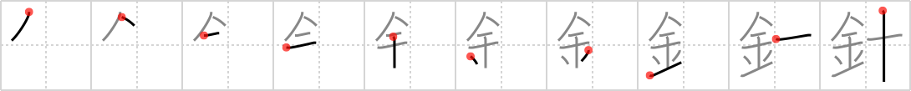

## `needle`

## [10]

## Reading:

### On-Yomi: シン &mdash; Kun-Yomi: はり

### Examples: 針 (はり)

## Words:

針路(しんろ): course, direction, compass bearing

針(はり): needle, fish hook, pointer, hand (clock)

針金(はりがね): wire

方針(ほうしん): objective, plan, policy

## Koohii stories:

1) [<a href="http://kanji.koohii.com/profile/gsantise">gsantise</a>] 26-8-2007(149): Remember the story of the<strong> needle</strong> in the haystack. Why would someone even look for a<strong> needle</strong> if it wasn&#039;t a GOLD<strong> NEEDLE</strong>? 

2) [<a href="http://kanji.koohii.com/profile/sprutnik">sprutnik</a>] 28-10-2008(80): A <em>golden</em><strong> needle</strong> is worth <em>ten</em> times more than an ordinary<strong> needle</strong>. 

3) [<a href="http://kanji.koohii.com/profile/sutebun">sutebun</a>] 12-9-2007(24): The golden<strong> needle</strong> is the true<strong> needle</strong>. 

4) [<a href="http://kanji.koohii.com/profile/dtstutz">dtstutz</a>] 28-1-2008(15): <strong>Needle</strong>s need to be metal (or they&#039;ll break). 

5) [<a href="http://kanji.koohii.com/profile/Spoonz">Spoonz</a>] 15-2-2009(11): Final fantasy reference! If you&#039;ve been petrified by one of those damned monsters, get a team mate to use a golden<strong> needle</strong> on you! 

6) [<a href="http://kanji.koohii.com/profile/tharvey">tharvey</a>] 14-2-2009(7): Not just any<strong> needle</strong>, but a <em>gold</em>en <em>needle</em>. 

7) [<a href="http://kanji.koohii.com/profile/drivers99">drivers99</a>] 16-6-2009(4): The best<strong> needle</strong>s are <em>metal</em><strong> needle</strong>s. Not wood or plastic<strong> needle</strong>s which become dull. 

8) [<a href="http://kanji.koohii.com/profile/ThisWayUp">ThisWayUp</a>] 1-10-2009(3): A golden<strong> NEEDLE</strong> is not a primitive<strong> NEEDLE</strong>! 

9) [<a href="http://kanji.koohii.com/profile/LoneDeranger">LoneDeranger</a>] 7-3-2009(3): Looking for a<strong> needle</strong> in a haystack is only worth your time if it is a <em>golden</em> <em>needle</em>. 

10) [<a href="http://kanji.koohii.com/profile/DavidZ">DavidZ</a>] 7-6-2010(2): The<strong> needle</strong> and the damage done... Neil Young melts down his <em>gold</em> record, &quot;Heart of <em>Gold</em>,&quot; in order to make <em>gold<strong> needle</strong>s</em>...   <a href="http://jisho.org/kanji/details/羅針盤">羅針盤</a>  [らしんばん] compass. 
