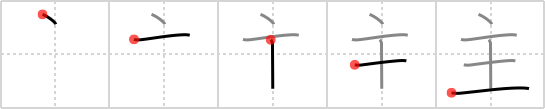

## `lord`

## [5]

## Reading:

### On-Yomi: シュ、ス、シュウ &mdash; Kun-Yomi: ぬし、おも、あるじ

## Heisig story:

A man's home is his castle, goes the proverb from an age where it was the male who was <b>lord</b> of the household. Fundamentally, it means only that every one of us is a bit (or <i>drop</i>) of a <i>king</i> in our own environment. As for the positioning of the elements, if you take care to &quot;read off&quot; the primitives in this way, you won't end up putting the <i>drop</i> down below, where it turns the kanji into a jewel.

## Premitive:

As a primitive element, we set the key word aside entirely and take it as a pictograph of a solid brass candlestick (with the drop representing the flame at the top)."

## Koohii stories:

1) [<a href="http://kanji.koohii.com/profile/sethimayne">sethimayne</a>] 22-10-2007(196): A<strong> lord</strong> is a little <em>drop</em> down from <em>King</em> in hierarchy.

2) [<a href="http://kanji.koohii.com/profile/Spoonz">Spoonz</a>] 15-2-2009(79): A<strong> lord</strong> only has a drop of the king&#039;s power.

3) [<a href="http://kanji.koohii.com/profile/Murjab">Murjab</a>] 20-9-2007(28): Although this kanji&#039;s meaning hasn&#039;t caused me much trouble, I&#039;ve had problems remembering the direction of the <em>drop</em> above <em>king</em>, since <em>drops</em> at tops of kanji often seem to appear in different directions. To remember this one, I think of the placement of the <em>drop</em> in <em>jewel</em> (#256 玉). Both of them use the <em>king</em> primitive and include a short <em>drop</em> stroke going from the top left to bottom right.

4) [<a href="http://kanji.koohii.com/profile/trevlaw">trevlaw</a>] 8-11-2008(23): Oh<strong> lord</strong>! someone spat on the king.

5) [<a href="http://kanji.koohii.com/profile/MidoriTori">MidoriTori</a>] 7-8-2009(10): The<strong> lord</strong> wants to DROP something on the KING&#039;S head so he can become king himself.

6) [<a href="http://kanji.koohii.com/profile/applesuki">applesuki</a>] 28-9-2006(10): The<strong> lord</strong> of the flies is a <em>king</em> with a little fly buzzing around his head (poetic license with the <em>drop</em>).

7) [<a href="http://kanji.koohii.com/profile/T_Schultz">T_Schultz</a>] 2-8-2007(8): Each<strong> lord</strong> has a <em>drop</em> of his <em>king</em> in him.

8) [<a href="http://kanji.koohii.com/profile/ashman63">ashman63</a>] 25-3-2008(7): In<strong> Lord</strong> of the Rings: The return of the <em>King</em> only happens after the ring is <em>drop</em>ped into Mordor.

9) [<a href="http://kanji.koohii.com/profile/lifeflaw">lifeflaw</a>] 13-10-2011(5): How do you tell the<strong> lord</strong> from the <em>king</em>? The<strong> lord</strong> is the one with a <em>drop</em> of hairstyling jell on his head.

10) [<a href="http://kanji.koohii.com/profile/Nihonnub">Nihonnub</a>] 30-5-2009(5): The<strong> LORD</strong>, unlike the <em>king</em>, wore a feather in his hat. (Picture a<strong> lord</strong> from medieval times, wearing a colourful wide-brimmed hat, accented with a bright feather) ((Prim: Candlestick) <a href="http://www.costumes.org/history/renaissance/norris/book3plate36.jpg">http://www.costumes.org/history/renaissance/norris/book3plate36.jpg</a>.
