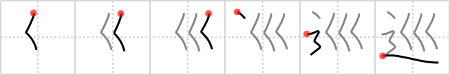

## `patrol`

## [6]

## Reading:

### On-Yomi: ジュン &mdash; Kun-Yomi: めぐ.る、めぐ.り

## Heisig story:

A virtual&nbsp;<i>flood</i> of motorcycle police washing down a <i>road</i> is this kanji's image for a <b>patrol</b>.

## Koohii stories:

1) [<a href="http://kanji.koohii.com/profile/dihutenosa">dihutenosa</a>] 28-8-2007(134): The cops don&#039;t<strong> PATROL</strong> anymore - they just <strong>flood</strong> the <strong>road</strong>.

2) [<a href="http://kanji.koohii.com/profile/diracbracket">diracbracket</a>] 16-11-2007(71): The Venice cops<strong> patrol</strong> on river roads.

3) [<a href="http://kanji.koohii.com/profile/romanrozhok">romanrozhok</a>] 11-6-2008(47): Crime has increased so the police have been recruiting PACMAN&#039;s to<strong> PATROL</strong> the STREETS. Here we see THREE of them<strong> PATROL</strong>LING around with their MOUTHS open.

4) [<a href="http://kanji.koohii.com/profile/mdspencer">mdspencer</a>] 19-1-2009(21): A<strong> patrol</strong> of rescue workers arrive to help clear the <em>flood</em> in the <em>road</em>.

5) [<a href="http://kanji.koohii.com/profile/Nukemarine">Nukemarine</a>] 23-2-2008(16): This should be easy. Imagine any news broadcast that shows the<strong> PATROL</strong> of police and national guard after the ROADS were FLOODED. Just to rescue the needy and stop the looters.

6) [<a href="http://kanji.koohii.com/profile/jhuijts">jhuijts</a>] 6-8-2006(10): In this character I think of the <em>stream</em> part as chevrons on the shoulders of police officers (apparently high in rank).

7) [<a href="http://kanji.koohii.com/profile/NooNoo">NooNoo</a>] 24-4-2008(7): After hurricane Katrina <em>flooded</em> the <em>roads</em>, the rescue<strong> patrol</strong>s surely had their hands full of work.

8) [<a href="http://kanji.koohii.com/profile/geddoe">geddoe</a>] 9-12-2012(5): After the <em>flood</em> we had to<strong> patrol</strong> the <em>road</em> for survivors.

9) [<a href="http://kanji.koohii.com/profile/gyouza">gyouza</a>] 23-6-2010(4): Cops in Venice <strong>patrol</strong> on <em>water</em> <em>ways</em>.

10) [<a href="http://kanji.koohii.com/profile/elitentity">elitentity</a>] 31-1-2006(4): A stream<strong> patrol</strong>s the road, washing away anyone it catches doing something illegal.
