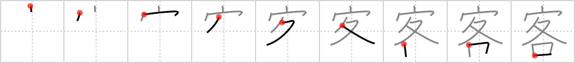

# {294}

## `guest`

## [9]

## Reading:

### On-Yomi: キャク、カク

### Examples: 客間 (きゃくま), 客車 (きゃくしゃ), 乗客 (じょうきゃく)

## Words:

客(きゃく): guest, customer

客観(きゃっかん): objective

乗客(じょうかく): passenger

旅客(りょかく): passenger (transport)

観客(かんきゃく): audience, spectator(s)

客席(きゃくせき): guest seating

客間(きゃくま): parlor, guest room

乗客(じょうきゃく): passenger

客(きゃく): guest
