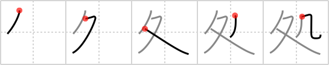

# {処}

## Strokes: 5

## Reading:

### On-Yomi: ショ &mdash; Kun-Yomi: ところ、-こ、お.る

## Words:

彼処(あそこ): (uk) there, over there, that place, (X) (col) genitals

処置(しょち): treatment

処罰(しょばつ): punishment

処分(しょぶん): disposal, dealing, punishment

其処(そこ): that place, there

其処で(そこで): so (conj), accordingly, now, then, thereupon

其処ら(そこら): everywhere, somewhere, approximately, that area, around there

対処(たいしょ): deal with, cope

処理(しょり): processing, dealing with, treatment, disposition, disposal
