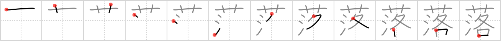

# {落}

## `fall`

## Strokes: 12

## Reading:

### On-Yomi: ラク &mdash; Kun-Yomi: お.ちる、お.ち、お.とす

### Examples: 落ちる (お.ちる), 落とす (お.とす)

## Words:

お洒落(おしゃれ): smartly dressed, someone smartly dressed, fashion-conscious

落ち込む(おちこむ): to fall into, to feel down (sad)

落ち着き(おちつき): calm, composure

落ち葉(おちば): fallen leaves, leaf litter, defoliation, shedding leaves

洒落(しゃらく): frank, open-hearted

洒落る(しゃれる): to joke, to play on words, to dress stylishly

墜落(ついらく): falling, crashing

転落(てんらく): fall, degradation, slump

没落(ぼつらく): ruin, fall, collapse

見落とす(みおとす): to overlook, to fail to notice

落下(らっか): fall, drop, come down

落着く(おちつく): calm down, settle in, be steady

落し物(おとしもの): lost property

洒落(しゃれ): frank, open-hearted

落第(らくだい): failure, dropping out of a class

落ちる(おちる): fall, drop, come down

落とす(おとす): drop, let fall
