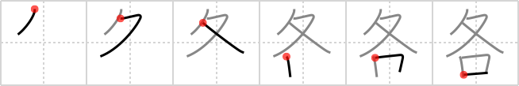

## `each`

## [6]

## Reading:

### On-Yomi: カク &mdash; Kun-Yomi: おのおの

## Heisig story:

&quot;Suum cuique&quot; goes the popular Latin proverb. A certain disease of the English language makes it almost impossible to translate the phrase without gender bias. In any event, here we see someone walking with his/her <i>mouth</i> between his/her <i>walking legs</i>, giving us an image of &quot;To <b>each</b> his/her own.&quot;

## Premitive:

walking legs We call this element walking legs because it indicates &quot;legs in motion,&quot; whether you want to think of them as jogging or walking in long strides, as the shape seems to suggest. Be careful how you write it, with the first two strokes like a stylized &quot;7.&quot; [3] &quot;Suum cuique&quot; goes the popular Latin proverb. A certain disease of the English language makes it almost impossible to translate the phrase without gender bias. In any event, here we see someone walking with his/her mouth between his/her walking legs, giving us an image of &quot;To each his/her own.&quot; [6] * The sense of the proverb should help when using this kanji as a primitive; otherwise, reduce it to its original elements. But do not associate it in any way with the word &quot;every,&quot; which we shall meet later in another context.

## Koohii stories:

1) [<a href="http://kanji.koohii.com/profile/penne">penne</a>] 16-3-2008(260): Son, I&#039;ve never told you this but<strong> each</strong> woman has a second <em>mouth</em> between their fiiiiiine <em>walking legs</em>.

2) [<a href="http://kanji.koohii.com/profile/johanvg">johanvg</a>] 18-7-2006(156): <strong>Each</strong> and every one of us walks and talks differently.

3) [<a href="http://kanji.koohii.com/profile/miki76">miki76</a>] 15-12-2008(87): <strong>Each</strong> person is gifted with a <em>mouth</em> to get us into trouble and a pair of <em>walking legs</em> to get us out!

4) [<a href="http://kanji.koohii.com/profile/Zareon">Zareon</a>] 12-2-2007(67): It&#039;s easier for me to remember a concrete object. This combination occurs often enough for me to make it a primitive element. Walking legs and mouth combine to give a &quot;walky talky&quot; or mobile phone. Imagine one of those old big ones which looked like refridgerators. Mobile phones are so popular that<strong> each</strong> of us seems to want one.

5) [<a href="http://kanji.koohii.com/profile/Ninjasha">Ninjasha</a>] 6-2-2008(39): <strong>EACH</strong> of us learns first to use our <em>legs to walk</em> and then to use our <em>mouths</em> to talk.

6) [<a href="http://kanji.koohii.com/profile/RobMow">RobMow</a>] 10-4-2008(19): <strong>Each</strong> pair of legs has at least one hole between them.

7) [<a href="http://kanji.koohii.com/profile/misha">misha</a>] 29-7-2007(19): It is easy to confuse this kanji with <a href="../v4/458">every</a> (#458 毎) -- &#039;each&#039; and &#039;every&#039; generally mean the same thing in the English language, it&#039;s just their usage is different -- for example, you cannot use &#039;every&#039; to describe objects in a group of size less than 3. This kanji shows someone&#039;s <em>walking legs</em> at an open man-<em>hole</em>.<strong> Each</strong> leg wants to go its&#039; own way -- the left foot wants to go left, and the right foot wants to go right.

8) [<a href="http://kanji.koohii.com/profile/PATRICKRL">PATRICKRL</a>] 1-8-2010(16): WARNING: DO NOT use a &quot;woman has an extra mouth story&quot;, you may begin using &quot;woman&quot; instead of &quot;walking legs&quot; for the top element.

9) [<a href="http://kanji.koohii.com/profile/aphasiac">aphasiac</a>] 11-3-2010(7): Imagine a Head Park Ranger talking to his squad - &quot;I want<strong> EACH</strong> of you to take a <em>walkie talkie</em> and radio back to the base at regular intervals...now move it men!!&quot; (each is too vague, so I use <strong>walkie-talkie</strong> (walking legs + mouth) as a primitive from now on).

10) [<a href="http://kanji.koohii.com/profile/Rhadryn">Rhadryn</a>] 6-3-2010(6): <strong>Each</strong> person should consider walking the walk a higher priority than talking the talk.
