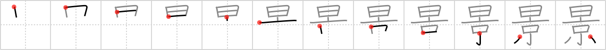

## `scenery`

## [12]

## Reading:

### On-Yomi: ケイ

## Heisig story:

<b>Scenery</b> is depicted as a <i>sun</i> rising over a <i>capital</i>&nbsp;city, which is a bit of natural <b>scenery</b>&nbsp;the city dwellers themselves rarely get to see!

## Koohii stories:

1) [<a href="http://kanji.koohii.com/profile/Raichu">Raichu</a>] 14-1-2006(227): Imaging the sun rising over the capital--classic postcard<strong> scenery</strong>.

2) [<a href="http://kanji.koohii.com/profile/Tzadeck">Tzadeck</a>] 12-3-2009(33): Anyone who&#039;s been to Kyoto doesn&#039;t need to think too deeply into this Kanji! Imagine a <em>sunny</em> day in the old <em>capital</em>, and there&#039;s no better<strong> scenery</strong>.

3) [<a href="http://kanji.koohii.com/profile/Aouwra">Aouwra</a>] 6-11-2007(11): There&#039;s no<strong> scenery</strong> quite so nice as the sun setting over China&#039;s ancient <em>capital</em>, the forbidden city.

4) [<a href="http://kanji.koohii.com/profile/Akeiko">Akeiko</a>] 1-2-2011(5): The <em>sun</em> shining <em>over the capital</em> is a nice<strong> scenery</strong> indeed.

5) [<a href="http://kanji.koohii.com/profile/Gibbun">Gibbun</a>] 7-7-2012(4): When the SUN rises over the CAPITAL, the<strong> SCENERY</strong> is just amazing.

6) [<a href="http://kanji.koohii.com/profile/alphador">alphador</a>] 31-1-2010(3): Immagina questo SCENARIO da favola: il SOLE che sorge sulla CAPITALE.

7) [<a href="http://kanji.koohii.com/profile/marcus">marcus</a>] 4-8-2008(3): The sun rose over the capital. The<strong> scenery</strong> beKEIm (became) almost palpable.

8) [<a href="http://kanji.koohii.com/profile/j0k0m0">j0k0m0</a>] 2-12-2010(2): Sunrise over the capital...quite scenic, &#039;k？ &#039;け， sunrise on the capitol- scenic ok? O <a href="midori://search?text=景。">景。</a> says South Park school teacher. 景色 (けしき)<strong> scenery</strong> 景気 (けいき) condition / state / business (condition) 風景 (ふうけい)<strong> scenery</strong> 光景 (こうけい) scene / spectacle .

9) [<a href="http://kanji.koohii.com/profile/ebat79">ebat79</a>] 4-10-2010(2): <strong>Paesaggio</strong>, <strong>Scenario</strong> : Pensare a quale miglior scenario ci può essere di un sole che sorge lungo lo skyline di una capitale come Tokyo. <strong>Composizione</strong> : Sole <a href="../12">day</a> (#12 日) + Capitale <a href="../312">capital</a> (#312 京). <strong>On</strong> : ケイ <strong>名乗り</strong> : かげ.

10) [<a href="http://kanji.koohii.com/profile/mdspencer">mdspencer</a>] 5-3-2009(2): It takes over a <em>day</em> to view all the<strong> scenery</strong> in the <em>capital</em>.
