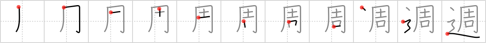

## {318}

## `week`

## [11]

## Reading:

### On-Yomi: シュウ

## Words:

隔週(かくしゅう): every other week

週間(しゅうかん): week, weekly

再来週(さらいしゅう): week after next

週(しゅう): week

先々週(せんせんしゅう): week before last

さ来週(さらいしゅう): the week after next

今週(こんしゅう): this week

先週(せんしゅう): last week, the week before

毎週(まいしゅう): every week

来週(らいしゅう): next week
