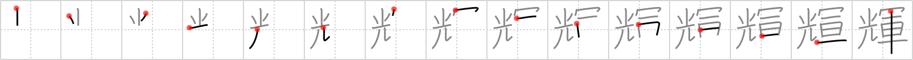

## `radiance`

## [15]

## Reading:

### On-Yomi: キ &mdash; Kun-Yomi: かがや.く

## Heisig story:

Take advantage of the first syllable of the key word to think of the <i>ray</i> of light to the left. Now add the glittering <i>chariot</i> that is emitting those <i>rays</i> and you have <b>radiance</b>.

## Koohii stories:

1) [<a href="http://kanji.koohii.com/profile/dwhitman">dwhitman</a>] 29-10-2007(197): Rays of light emitted from Apollo&#039;s chariot =<strong> radiance</strong>. Don&#039;t put the sun into this kanji. The rays are coming from the chariot directly!

2) [<a href="http://kanji.koohii.com/profile/erlog">erlog</a>] 18-7-2008(134): <strong>Radiance</strong> is an army of rays.

3) [<a href="http://kanji.koohii.com/profile/anroo">anroo</a>] 25-7-2009(59): <strong>Radiance</strong> isn&#039;t just a few <em>rays</em>, but a whole <em>army</em> of them.

4) [<a href="http://kanji.koohii.com/profile/sethimayne">sethimayne</a>] 25-10-2007(30): When I think of<strong> radiance</strong> I think of the greek god Zeus - picture him throwing <em>rays</em> of lightning (hence the extra jaggedness of the character) from atop his <em>chariot</em> riding through the heavens.

5) [<a href="http://kanji.koohii.com/profile/brendanmacdonald">brendanmacdonald</a>] 21-4-2008(13): Ray&#039;s little legs joined the army - so Ray-did-a-dance (radiance).

6) [<a href="http://kanji.koohii.com/profile/Kieron">Kieron</a>] 16-4-2007(7): The victorious <em>army</em> general parades through the city on his <em>chariot</em>, looking <strong>radiant</strong> as the sun&#039;s <em>rays</em> shines off of his polished dress armor.

7) [<a href="http://kanji.koohii.com/profile/stan_in_japan">stan_in_japan</a>] 7-5-2012(6): <strong>Radiance</strong> is made up of <em>rays</em> - not a few, an <em>army</em> of them!

8) [<a href="http://kanji.koohii.com/profile/lifeflaw">lifeflaw</a>] 15-10-2011(6): <strong>Radiance</strong> is just a <em>Photon Army</em>! I imagine<strong> radiance</strong> as <em>photon</em>s moving like an <em>army</em> and hitting the surfaces the gets in their way. So,<strong> radiance</strong> is <em>Photon Army</em>! Compare to <a href="../119">ray</a> (#119 光).

9) [<a href="http://kanji.koohii.com/profile/Green_Airplane">Green_Airplane</a>] 6-3-2010(6): The US army has equipped their <em>tanks</em> with a new weapon. They now shoot radioactive <em>rays</em> from their cannons. The <em>rays</em> are <strong>radiant</strong> green, it looks damn good on CNN. Mnemonic: Radiant Ray Tanks (to remember the order of the elements).

10) [<a href="http://kanji.koohii.com/profile/jabberwockychortles">jabberwockychortles</a>] 11-9-2009(5): Picture an <em>army</em> of approaching men wearing metal armor, as the <em>rays</em> hit the troops the<strong> radiance</strong> is blinding.
