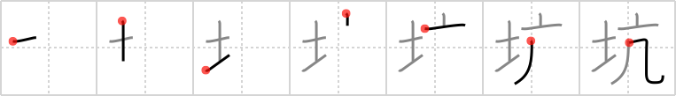

## `pit`

## [7]

## Reading:

### On-Yomi: コウ

## Heisig story:

A <i>whirlwind</i> begins to dig its way into the <i>soil</i> like a drill until it makes a deep <b>pit</b>.

## Premitive:

top hat @ The broad rim and tall top of the top hat is pictured graphically here in these two simple strokes. At this point, by the way, you can revert back to FRAME 6 六. If you have had any trouble with that character, you now have the requisite elements to make a story: Six suggests the number of spider’s legs; just set a tall silk top hat on the crawling creature and you have your character. [2]

## Koohii stories:

1) [<a href="http://kanji.koohii.com/profile/dingomick">dingomick</a>] 6-2-2007(155): A <em>whirlwind</em> digs a hole in the ground throwing out lots of <em>dirt</em> until it ends up with a giant <strong>pit</strong>.

2) [<a href="http://kanji.koohii.com/profile/Wahlin">Wahlin</a>] 7-9-2006(59): Tazmanian Devil whirlwinds a<strong> pit</strong> into the soil. Note: Take care difference between<strong> pit</strong> and rut.

3) [<a href="http://kanji.koohii.com/profile/Ninjasha">Ninjasha</a>] 17-2-2008(41): All the <em>soil</em> was thrown to the left as the Tasmanian Devil&#039;s <em>whirlwind</em> swirled out a<strong> PIT</strong>.

4) [<a href="http://kanji.koohii.com/profile/shimouma">shimouma</a>] 29-3-2008(22): Down in the earth, there&#039;s a<strong> pit</strong> where you&#039;ll find miners in top hats constantly breaking wind.

5) [<a href="http://kanji.koohii.com/profile/Alunalun">Alunalun</a>] 19-7-2010(13): A<strong> pit</strong> is cut into the <em>soil</em> by a magician archaeologist. He uses a <em>whirlwind</em>. (and for the primitive:) A <strong>whirlwind</strong> is made by a magician from his <em>top hat</em>, he holds it up and a ferocious <em>wind</em> whirls out of it, messing up the attire of everyone in the front row. <em>[RTK2 #221, pure group, コウ. signal primitive </em>whirlwind<em> is コウ because you will get コウght in it unless you are at the very コウ=core]</em>.

6) [<a href="http://kanji.koohii.com/profile/Saruyatsu">Saruyatsu</a>] 19-9-2011(10): Dig a<strong> PIT</strong>: Take the DIRT out and put LID on it to protect you from the WIND. // こう　/// 坑道 こうどう　mineshaft, tunnel /// 坑夫 こうふ　a mineworker, miner /// 坑木 こうぼく　a mine pillar, a<strong> pit</strong> prop.

7) [<a href="http://kanji.koohii.com/profile/mikes">mikes</a>] 20-5-2007(10): Brad<strong> PIT</strong>t wears a TOP HAT. It gets blown away in the WIND and ends up messed up in the SOIL<strong> PIT</strong> (therefore becomes SOILed by the WIND).

8) [<a href="http://kanji.koohii.com/profile/Sjolund">Sjolund</a>] 2-2-2012(6): The<strong> PIT</strong> was made in the <em>soil</em> by a <em>whirlwind</em> (=<em>top hat</em> + <em>wind</em>).

9) [<a href="http://kanji.koohii.com/profile/wulfgar">wulfgar</a>] 16-8-2009(5): I imagine the Tasmanian devil with a <em>TOP HAT</em> on from Loony toons spinning as the <em>WHIRLWIND</em> and he is spinning so fiercely that <em>SOIL</em> is flying everywhere. Thus, creating a<strong> PIT</strong>! When imagined it is easy to see how the soil is the strong element.

10) [<a href="http://kanji.koohii.com/profile/blaked569">blaked569</a>] 1-2-2009(4): I was a piece of shit - the <em>dirt</em> of society. Knowing this cast me into the<strong> pit</strong> of despair, where the <em>whirlwinds</em> of regret and self-loathing tormented me every metaphor-ridden day.
