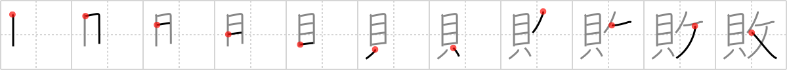

# {敗}

## `failure`

## Strokes: 11

## Reading:

### On-Yomi: ハイ &mdash; Kun-Yomi: やぶ.れる

### Examples: 敗れる (やぶ.れる)

## Words:

一敗(いっぱい): one defeat

敗戦(はいせん): defeat, losing a war

腐敗(ふはい): decay, depravity

勝敗(しょうはい): victory or defeat, issue (of battle)

失敗(しっぱい): failure, fail
