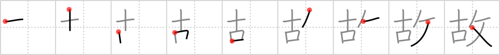

## `happenstance`

## [9]

## Reading:

### On-Yomi: コ &mdash; Kun-Yomi: ゆえ、ふる.い、もと

## Heisig V6:

Call it fate or providence or plain old Lady Luck, <b>happenstance</b> is the <i>oldest taskmaster</i> we know. It nearly always has its way.

## Koohii stories:

1) [<a href="http://kanji.koohii.com/profile/Deborah">Deborah</a>] 27-10-2007(127): An <em>OLD TASKMASTER</em> is no<strong> happenstance</strong> (coincidence). The older you get the more rigid in your ways.

2) [<a href="http://kanji.koohii.com/profile/misha">misha</a>] 23-7-2007(51): Need to disambiguate from <a href="../443">enemy</a> (#443 敵) as it&#039;s easy to mix up <strong>antique</strong> and <strong>old</strong> here. Let&#039;s think of an accidental president -- he is an <strong>old</strong> <strong>taskmaster</strong> who has managed to win the election by<strong> happenstance</strong> .

3) [<a href="http://kanji.koohii.com/profile/binky">binky</a>] 29-7-2009(30): Only an old taskmaster uses a stupid word like &quot;happenstance&quot; instead of the many less pretentious synonyms for luck or chance.

4) [<a href="http://kanji.koohii.com/profile/dogray77">dogray77</a>] 22-1-2008(30): It&#039;s not just a<strong> happenstance</strong> that the taskmaster looks old before his time.

5) [<a href="http://kanji.koohii.com/profile/meredithcat">meredithcat</a>] 4-4-2010(18): I recently ran into my <em>old taskmaster</em> purely by<strong> happenstance</strong>.

6) [<a href="http://kanji.koohii.com/profile/Valiant">Valiant</a>] 11-1-2009(17): Nothing as flashy as Lady Luck,<strong> HAPPENSTANCE</strong> is just a crusty OLD TASKMASTER.

7) [<a href="http://kanji.koohii.com/profile/zardoz73">zardoz73</a>] 31-7-2008(17): It would be pure<strong> happenstance</strong> if the old man met his former dominatrix from 50 years ago.

8) [<a href="http://kanji.koohii.com/profile/Danieru">Danieru</a>] 7-12-2007(9): It&#039;s no<strong> happenstance</strong> that this kanji actually means CIRCUMSTANCE. What&#039;s that <em>old taskmaster&#039;s</em> problem? Why is he such a hard-ass? Well, he didn&#039;t have very good childhood circumstances...

9) [<a href="http://kanji.koohii.com/profile/mavelle">mavelle</a>] 13-3-2011(6): It was not by<strong> happenstance</strong> that <em>hitler</em> didn&#039;t get very <em>old</em>.

10) [<a href="http://kanji.koohii.com/profile/Immacolata">Immacolata</a>] 31-1-2006(5): <strong>Happenstance</strong> is an <em>old taskmaster</em> - a chance that you get rather to luck and circumstances. It is purely by<strong> happenstance</strong> that the <em>Old Taskmaster</em> Castro is still in control of cuba. I mean it hasn&#039;t been for lack of trying the last 45 years that the USA has been unable to get rid of him. So imagine an old, greyhaired castro, wrinkled but still fiercely defying USA.
