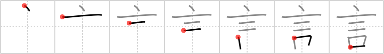

# {言}

## Strokes: 7

## Reading:

### On-Yomi: ゲン、ゴン &mdash; Kun-Yomi: い.う、こと

### Examples: 言行 (げんこう), 言論 (げんろん), 宣言 (せんげん), 言う (い.う), 言 (こと)

## Words:

言い訳(いいわけ): excuse, explanation

一言(いちげん): single word

片言(かたこと): a smattering, talk like a baby, speak haltingly

予言(かねごと): prediction, promise, prognostication

言論(げんろん): discussion

言伝(ことづて): declaration, hearsay

証言(しょうげん): evidence, testimony

助言(じょげん): advice, suggestion

宣言(せんげん): declaration, proclamation, announcement

断言(だんげん): declaration, affirmation

伝言(つてごと): verbal message, rumor, word

発言(はつげん): utterance, speech, proposal

無言(むごん): silence

言い出す(いいだす): start talking, propose, suggest, break the ice

言い付ける(いいつける): tell, tell on (someone), to order, to charge, to direct

言わば(いわば): so to speak, so to call it, as it were

言語(げんご): language

言付ける(ことづける): send word, send a message

言葉遣い(ことばづかい): speech, expression, wording

一言(ひとこと): single word

独り言(ひとりごと): soliloquy, monologue, speaking to oneself

方言(ほうげん): dialect

言う(いう): to say

言葉(ことば): word(s), phrase, language, speech
