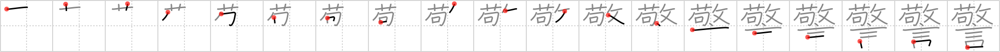

# {警}

## Strokes: 19

## Reading:

### On-Yomi: ケイ &mdash; Kun-Yomi: いまし.める

## Words:

警戒(けいかい): warning, admonition, vigilance

警部(けいぶ): police inspector

警告(けいこく): warning, advice

警備(けいび): defense, guard, policing, security

警官(けいかん): policeman

警察(けいさつ): police
