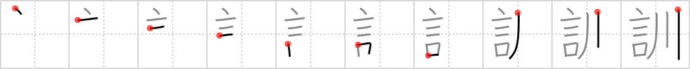

## {341}

## `instruction`

## [10]

## Reading:

### On-Yomi: クン、キン &mdash; Kun-Yomi: おし.える、よ.む、くん.ずる

## Words:

教訓(きょうくん): lesson, precept, moral instruction

訓(くん): native Japanese reading of a Chinese character

訓練(くんれん): practice, training
