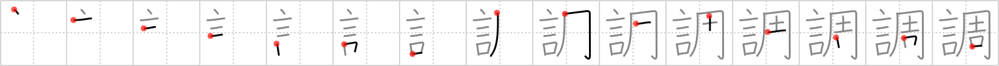

## {349}

## `tune`

## [15]

## Reading:

### On-Yomi: チョウ &mdash; Kun-Yomi: しら.べる、しら.べ、ととの.う、ととの.える

### Examples: 調べる (しら.べる), 調う (ととの.う), 調える (ととの.える)

## Words:

協調(きょうちょう): co-operation, conciliation, harmony, firm (market) tone

好調(こうちょう): favourable, promising, satisfactory, in good shape

下調べ(したしらべ): preliminary investigation, preparation

失調(しっちょう): lack of harmony

調べ(しらべ): preparation, investigation, inspection

単調(たんちょう): monotony, monotone, dullness

調印(ちょういん): signature, sign, sealing

調停(ちょうてい): arbitration, conciliation, mediation

調理(ちょうり): cooking

調和(ちょうわ): harmony

同調(どうちょう): sympathy, agree with, alignment, tuning

取り調べる(とりしらべる): to investigate, to examine

不調(ふちょう): bad condition, not to work out (ie a deal), disagreement, break-off, disorder, slump, out of form

強調(きょうちょう): emphasis, stress, stressed point

順調(じゅんちょう): favourable, doing well, O.K., all right

調査(ちょうさ): investigation, examination, inquiry, survey

調子(ちょうし): tune, tone, key, pitch, time, rhythm, vein, mood, way, manner, style, knack, condition, state of health, strain, impetus, spur of the moment, trend

調整(ちょうせい): regulation, adjustment, tuning

調節(ちょうせつ): regulation, adjustment, control

調味料(ちょうみりょう): condiment, seasoning

調べる(しらべる): investigate
