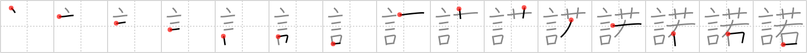

## `consent`

## [15]

## Reading:

### On-Yomi: ダク

## Koohii stories:

1) [<a href="http://kanji.koohii.com/profile/Ninjasha">Ninjasha</a>] 19-2-2008(158): The <em>words</em> of the very <em>young</em> are useless without<strong> CONSENT</strong> from their elders. 

2) [<a href="http://kanji.koohii.com/profile/Megaqwerty">Megaqwerty</a>] 19-4-2007(102): Delores might <em>say</em>, &quot;Yes!&quot;, but she&#039;s way too <em>young</em> give any legal <strong>consent</strong>. 

3) [<a href="http://kanji.koohii.com/profile/dshill99">dshill99</a>] 2-4-2008(29): <strong>Consent</strong> is <em>words</em> given to the <em>young</em>. 

4) [<a href="http://kanji.koohii.com/profile/anthropic">anthropic</a>] 11-3-2008(16): You may get her <strong>consent</strong> if you <em>say</em> romantic things and she is too <em>young</em> to know any better. 

5) [<a href="http://kanji.koohii.com/profile/Levence">Levence</a>] 29-11-2008(8): Picture a cute loli holding flowers in her right hand, and you want to go over and talk to her, but you need parental<strong> CONSENT</strong> otherwise you will go to jail. 

6) [<a href="http://kanji.koohii.com/profile/burritokun">burritokun</a>] 19-8-2008(8): Try <em>telling</em> the judge &quot;she told me she was 18! I didn&#039;t know she was that <em>young</em> &quot; when you&#039;re arrested for violating the age of<strong> consent</strong> laws. 

7) [<a href="http://kanji.koohii.com/profile/fjolnir">fjolnir</a>] 22-11-2009(7): Without parental<strong> consent</strong>, the <em>words</em> of a <em>young</em> one have no weight. 

8) [<a href="http://kanji.koohii.com/profile/MethodGT">MethodGT</a>] 16-2-2008(7): I have trouble remembering to put <em>young</em> here instead of <a href="../436">juvenile</a> (#436 <a href="http://jisho.org/kanji/details/童">童</a>), so here goes: &quot;What?!&quot; The <em>young</em> boy <em>said</em>, &quot;I still have to have my parents&#039;<strong> consent</strong> to see this R rated movie, even though I already told you that yesterday I was 70, but I walked through the <em>&#039;Field of Youth&#039;</em> and picked a flower with my right hand, and became a boy again?&quot;. 

9) [<a href="http://kanji.koohii.com/profile/jabberwockychortles">jabberwockychortles</a>] 17-6-2009(5): <em>Words</em> of<strong> consent</strong> are needed by the <em>young</em>. 

10) [<a href="http://kanji.koohii.com/profile/SteelGolem">SteelGolem</a>] 16-8-2011(4): Imagine a man on his knee with [flowers] in his [right] hand, and his left held out and upwards: he is using [words] on a [young] woman to get her<strong> CONSENT</strong>. 
