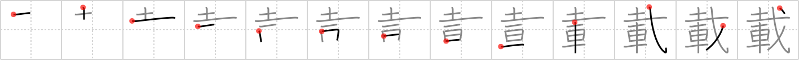

# {載}

## `load`

## Strokes: 13

## Reading:

### On-Yomi: サイ &mdash; Kun-Yomi: の.せる、の.る

### Examples: 載せる (の.せる), 載る (の.る)

## Words:

記載(きさい): mention, entry

掲載(けいさい): appearance (e.g. article in paper)

載せる(のせる): to place on (something), to take on board, to give a ride, to let (one) take part, to impose on, to record, to mention, to load (luggage), to publish, to run (an ad)

載る(のる): get on, ride in, board, mount, get up on, be taken in, share in, join, be found in (a dictionary), feel like doing, be mentioned in, be in harmony with, appear (in print), be recorded
