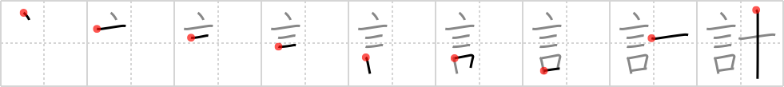

## `plot`

## [9]

## Reading:

### On-Yomi: ケイ &mdash; Kun-Yomi: はか.る、はか.らう

## Heisig story:

<i>Words</i> and a meter's <i>needle</i> combine to form the sense of <b>plot</b>: to talk over plans and to calculate a course of action.

## Koohii stories:

1) [<a href="http://kanji.koohii.com/profile/mspertus">mspertus</a>] 12-6-2006(222): A<strong> plot</strong> is a summary of a book that can be given in <em>ten</em> <em>words</em>.

2) [<a href="http://kanji.koohii.com/profile/gaijinda">gaijinda</a>] 28-10-2007(124): <em>Say-ten</em>&#039;s (satan&#039;s) evil<strong> plot</strong>.

3) [<a href="http://kanji.koohii.com/profile/romanrozhok">romanrozhok</a>] 19-7-2008(110): This does NOT mean a &quot;summary of a book.&quot; It means plan, project, or to measure. STORY: A TEN WORD PLAN is a very efficient PLAN.

4) [<a href="http://kanji.koohii.com/profile/smithsonian">smithsonian</a>] 17-10-2006(55): It took only the <em>words</em> of <em>ten</em> men to<strong> plot</strong> the downfall of Caesar.

5) [<a href="http://kanji.koohii.com/profile/diracbracket">diracbracket</a>] 30-3-2011(33): I have only <em>ten words</em> to say about this kanji: &quot;Remember, remember the fifth of November, gunpowder treason and<strong> plot</strong>&quot;.

6) [<a href="http://kanji.koohii.com/profile/cjon256">cjon256</a>] 1-5-2009(21): A really complex<strong> plot</strong> is hard to remember; so <em>say</em> it to yourself <em>10</em> times and you&#039;ll keep it straight. I get this confused with <a href="../214">plan</a> (#214 案), so my mneumonic: plan is simple,<strong> plot</strong> is complex.

7) [<a href="http://kanji.koohii.com/profile/jwy2k2">jwy2k2</a>] 5-9-2007(13): 1 boy 2 meets 3 girl 4 fall 5 in 6 love 7 live 8 happily 9 ever 10 after.

8) [<a href="http://kanji.koohii.com/profile/Naito1290">Naito1290</a>] 2-11-2009(10): Only ten words are needed in this<strong> plot</strong>. The End.

9) [<a href="http://kanji.koohii.com/profile/mrgrimm">mrgrimm</a>] 14-9-2009(10): Words stitched together with a needle form a<strong> plot</strong>.

10) [<a href="http://kanji.koohii.com/profile/mightymiff">mightymiff</a>] 19-7-2009(8): Words . . . needle The voodoo practitioner<strong> plot</strong>ted to kill all of his foes with <em>words</em> and <em>needle</em>s.
