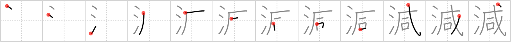

# {減}

## Strokes: 12

## Reading:

### On-Yomi: ゲン &mdash; Kun-Yomi: へ.る、へ.らす

### Examples: 減らす (へ.らす), 減る (へ.る)

## Words:

いい加減(いいかげん): moderate, right, random, not thorough, vague, irresponsible, halfhearted

軽減(けいげん): abatement

減少(げんしょう): decrease, reduction, decline

減点(げんてん): subtract, give a demerit

削減(さくげん): cut, reduction, curtailment

加減(かげん): addition and subtraction, degree, extent, measure, chance

増減(ぞうげん): increase and decrease, fluctuation

減らす(へらす): abate, decrease, diminish, shorten

減る(へる): decrease (in size or number), diminish, abate
