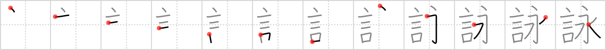

## `recitation`

## [12]

## Reading:

### On-Yomi: エイ &mdash; Kun-Yomi: よ.む、うた.う

## Heisig story:

Listening to the <i>words</i> of poets <b>reciting</b> their poetry is like being transported for a moment into <i>eternity</i> where the rules of everyday life have been suspended.

## Koohii stories:

1) [<a href="http://kanji.koohii.com/profile/sethimayne">sethimayne</a>] 3-11-2007(154): If you study some <em>words</em> for a<strong> recitation</strong>, there is a good chance they will be stuck in your memory for all <em>eternity</em>.

2) [<a href="http://kanji.koohii.com/profile/cangy">cangy</a>] 1-4-2008(110): Listening to the <em>words</em> in a<strong> recitation</strong> of Vogon poetry is worse than spending an <em>eternity</em> in hell. [<strong>Note:</strong> I assume those 2 reports are to warn against possible confusion with <a href="../346">poem</a> (#346 詩) but how can you confuse <em>Vogon poetry</em> with an actual <em>poem</em>? Anyway, it&#039;s the next frame, so it should be easy to keep them straight... Or maybe there&#039;s a kanji for <em>Vogon</em> in RTK3?].

3) [<a href="http://kanji.koohii.com/profile/rtkrtk">rtkrtk</a>] 17-1-2008(57): Don&#039;t confuse with <a href="../346">poem</a> (#346 詩). Focus on the re- part of re-citation: making a citation of <em>words</em> over, and over, and over, and over, and over again, until <em>eternity</em>.

4) [<a href="http://kanji.koohii.com/profile/AndamanIslander">AndamanIslander</a>] 5-2-2008(15): [for catholics only:] During the <strong>recitation</strong> of the holy rosary, the <em>words</em> feel like they will take an <em>eternity</em> to say...it takes soooo long.

5) [<a href="http://kanji.koohii.com/profile/fuaburisu">fuaburisu</a>] 14-10-2005(14): For me, the keyword suggests something not as pleasant as in James&#039;s Heisig story. In my mind, a<strong> recitation</strong> is when someone reads out loud something that they have read, without the slightest bit of improvisation or impersonation, in a very monotonous, and extremely dull manner. Hence, a<strong> recitation</strong> is a long-winded <em>speech</em> that seems to go on for an <em>eternity</em> (because it&#039;s so dull and you&#039;re so bored).

6) [<a href="http://kanji.koohii.com/profile/Raichu">Raichu</a>] 25-1-2006(11): A<strong> recitation</strong> of a boring poem can feel like the words are droning on forever.

7) [<a href="http://kanji.koohii.com/profile/mikemikepw">mikemikepw</a>] 27-9-2007(9): Imagine that you are a judge at a JHS<strong> recitation</strong> contest. The words seem to go on and on for an eternity.

8) [<a href="http://kanji.koohii.com/profile/munstrosity">munstrosity</a>] 14-3-2011(8): The <em>words</em> of a boring<strong> recitation</strong> seem to go on for <em>eternity</em>.

9) [<a href="http://kanji.koohii.com/profile/OrangeNut">OrangeNut</a>] 11-1-2009(6): In Hell, they <strong>recite</strong> the <em>words</em> from Barney&#039;s theme song for <em>eternity</em>.

10) [<a href="http://kanji.koohii.com/profile/zardoz73">zardoz73</a>] 31-7-2008(4): A<strong> recitation</strong> of Vogon poetry is a blur of terrible words that goes on for eternity. (thanks to cangy).
