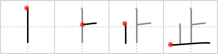

# {止}

## `stop`

## Strokes: 4

## Reading:

### On-Yomi: シ &mdash; Kun-Yomi: と.まる、-ど.まり、と.める、-と.める、-ど.め、とど.める、とど.め、とど.まる、や.める、や.む、-や.む、よ.す、-さ.す、-さ.し

### Examples: 止まる (と.まる), 止める (と.める)

## Words:

受け止める(うけとめる): to catch, to stop the blow, to react to, to take

静止(せいし): stillness, repose, standing still

阻止(そし): obstruction, check, hindrance, prevention, interdiction

止まる(とどまる): to be limited to

止める(とどめる): to stop, to cease, to put an end to

廃止(はいし): abolition, repeal

止むを得ない(やむをえない): cannot be helped, unavoidable

呼び止める(よびとめる): to challenge, to call somebody to halt

禁止(きんし): prohibition, ban

立ち止まる(たちどまる): stop, halt, stand still

中止(ちゅうし): suspension, stoppage, discontinuance, interruption

停止(ていし): suspension, interruption, stoppage, ban, standstill, deadlock, stalemate, abeyance

引き止める(ひきとめる): detain, restrain

防止(ぼうし): prevention, check

止む(やむ): stop (e.g. rain)

止める(やめる): quit smoking

止す(よす): cease, abolish, resign, give up

止まる(とまる): come to a halt
