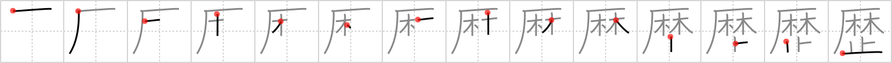

## {376}

## `curriculum`

## [14]

## Reading:

### On-Yomi: レキ、レッキ

## Words:

学歴(がくれき): academic background

経歴(けいれき): personal history, career

履歴(りれき): personal history, background, career, log

歴史(れきし): history
