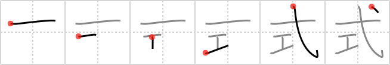

## `style`

## [6]

## Reading:

### On-Yomi: シキ

## Heisig story:

Take <b>style</b> in its sense of some fashion design or model. Then let the element <i>arrow</i> and <i>craft</i> stand for the well-known <b>style</b> of shirts known as &quot;<i>Arrow</i> shirts&quot; because of the little <i>arrow</i> sewn on each one.

## Premitive:

arrow(strzala) Here we see a pictograph of a long and slightly warped arrow. By extending the short final stroke in both directions, you should see the arrowhead without any difficulty. The hook at the bottom represents the feathers at the butt end. When it serves as a semienclosure for other primitives, the first stroke is drawn longer, as we shall see in the following FRAMEs. [3] A Take style in its sense of some fashion design or model. Then let the element arrow and craft stand for the well-known style of shirts known as ""Arrow shirts"" because of the little arrow sewn on each one. [6]"

## Koohii stories:

1) [<a href="http://kanji.koohii.com/profile/kiisu">kiisu</a>] 17-2-2008(196): Each Indian tribe crafts their arrows in a certain<strong> style</strong>..

2) [<a href="http://kanji.koohii.com/profile/shirahime">shirahime</a>] 20-8-2006(64): The latest<strong> style</strong> is shirts crafted out of arrows.

3) [<a href="http://kanji.koohii.com/profile/notgoing2argue">notgoing2argue</a>] 16-4-2007(40): To say someone has<strong> STYLE</strong> is to say they <em>craft</em> their image as sharp as an <em>arrow</em> .

4) [<a href="http://kanji.koohii.com/profile/plumage">plumage</a>] 8-10-2008(29): Legolas mastered the CRAFT of shooting ARROWS, so shoots with<strong> style</strong>.

5) [<a href="http://kanji.koohii.com/profile/Ninjasha">Ninjasha</a>] 19-2-2008(9): When you&#039;ve <em>crafted</em> your look to be as sharp as an <em>arrow</em>, then you&#039;ve got<strong> STYLE</strong>, baby ;o) !

6) [<a href="http://kanji.koohii.com/profile/JasonCRomero">JasonCRomero</a>] 7-9-2009(8): I can tell who <em>crafted</em> this <em>arrow</em> just by looking at the <strong>style</strong>.

7) [<a href="http://kanji.koohii.com/profile/dicedice">dicedice</a>] 23-7-2007(7): The new<strong> style</strong>s in Paris this year: wearing arts and <em>crafts</em><strong> style</strong>d clothing and an <em>arrow</em> through your head! (Picture supermodels walking down the catwalk with fingerpainted dresses plastered with dry macaroni and wearing an arrow-through-your-head hat).

8) [<a href="http://kanji.koohii.com/profile/WeTsTICK">WeTsTICK</a>] 24-5-2009(6): It used to be in<strong> style</strong> to craft arrows.

9) [<a href="http://kanji.koohii.com/profile/Chris+Knoke">Chris+Knoke</a>] 10-7-2010(4): Arrows are crafted with<strong> style</strong>.

10) [<a href="http://kanji.koohii.com/profile/aspr8045">aspr8045</a>] 28-2-2009(4): <strong>Style</strong> = arrow + craft. The elf has great<strong> STYLE</strong> in her <em>crafting</em> of <em>arrows</em>.
