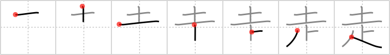

## {384}

## `run`

## [7]

## Reading:

### On-Yomi: ソウ &mdash; Kun-Yomi: はし.る

### Examples: 走る (はし.る)

## Words:

御馳走(ごちそう): feast, treating (someone)

ご馳走さま(ごちそうさま): feast

走行(そうこう): running a wheeled vehicle (e.g. car), traveling

逃走(とうそう): flight, desertion, escape

走る(はしる): to run
