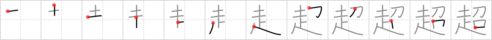

## {385}

## `transcend`

## [12]

## Reading:

### On-Yomi: チョウ &mdash; Kun-Yomi: こ.える、こ.す

### Examples: 超える (こ.える), 超す (こ.す)

## Words:

超える(こえる): to cross over, to cross, to pass through, to pass over (out of)

超(ちょう): super-, ultra-, hyper-

超す(こす): cross, pass, tide over

超過(ちょうか): excess, being more than
