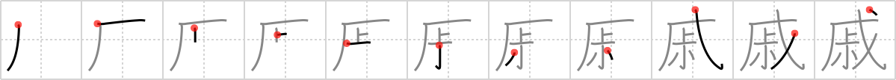

## `relatives`

## [11]

## Reading:

### On-Yomi: ソク、セキ &mdash; Kun-Yomi: いた.む、うれ.える、みうち

## Heisig story:

If you think of a <i>parade</i> of particularly disagreeable <b>relatives</b>, it should not be hard to imagine them as large bodies with <i>little</i> pea-brains <i>above</i>.

## Koohii stories:

1) [<a href="http://kanji.koohii.com/profile/Katsuo">Katsuo</a>] 26-10-2007(72): Your <em>half-uncle</em> is leading a <em>parade</em> of your<strong> relatives</strong>. (Note: 上 + 小 makes up part of &quot;uncle&quot; 叔 , so I&#039;ve called it &quot;half-uncle&quot;.).

2) [<a href="http://kanji.koohii.com/profile/FoxintheStars">FoxintheStars</a>] 1-8-2010(54): (Using the RTK1 supplement so I haven&#039;t had &quot;uncle&quot; yet.) When you take visiting<strong> relatives</strong> to a <em>parade</em>, hold the <em>little</em> ones <em>up above</em> so they can see over the crowd.

3) [<a href="http://kanji.koohii.com/profile/mantixen">mantixen</a>] 31-7-2009(9): Your <em>uncle</em> organizes a <em>parade</em> of all your<strong> relatives</strong>, which he himself is only half in because he&#039;s busy taking pictures of it.

4) [<a href="http://kanji.koohii.com/profile/ghinzdra">ghinzdra</a>] 7-5-2009(9): All my<strong> relatives</strong> seems to be here .They even organized a PARADE for me .Wait a minute : my UNCLE isn&#039;t here! oh I got it , I just noticed where he is but he has been forbid to scratch his crotch as usual and so I had trouble to recognize him ;.

5) [<a href="http://kanji.koohii.com/profile/wio_dude">wio_dude</a>] 2-8-2010(7): People carry their <em>small</em><strong> relatives</strong> <em>above</em> their shoulders so they can see the parade.

6) [<a href="http://kanji.koohii.com/profile/gavmck">gavmck</a>] 22-3-2010(2): As the <em>parade</em> passed, I lifted my <em>little</em> <strong>relative</strong> (niece/grandchild or whatever) <em>above</em> my shoulders so (s)he could get a better view.

7) [<a href="http://kanji.koohii.com/profile/Meconium">Meconium</a>] 9-3-2010(2): <em>Uncle Herbert the Pervert</em> has finally died, and all the <strong>relatives</strong> are holding a <em>parade</em> in his memory, and <strong>grieving</strong> (anothing meaning of this kanji), except for those who Herbert molested with his <em>crotch</em>, which is now in a box with the rest of his body.

8) [<a href="http://kanji.koohii.com/profile/mirnkaya">mirnkaya</a>] 17-2-2012(1): The <em>parade</em> was relatively <em>small</em> so I really needed <em>magic</em> if I hoped my<strong> relatives</strong> won&#039;t identify me on TV.

9) [<a href="http://kanji.koohii.com/profile/kapalama">kapalama</a>] 5-11-2010(1): 姻戚 , 親戚 , <a href="../v4/2882">relatives</a> (#2882 戚) セキ ... Parts:戊, <a href="http://google.com/#q=叔＊">叔＊</a> (cf 叔父さん <a href="../v4/718">uncle</a> (#718 叔), 歳 <a href="../v4/512">year-end</a> (#512 歳) ) ... Story: At the sex offender&#039;s family reunion <em>Parade</em>, the <em>Uncle</em> has to get rid of his <em>Crotch</em> to join with his<strong> Relatives</strong>.

10) [<a href="http://kanji.koohii.com/profile/CountPacula">CountPacula</a>] 26-3-2013(): It&#039;s more than just my <em>uncle</em> now - my whole house has become practically <em>overgrown</em> with<strong> relatives</strong>!
